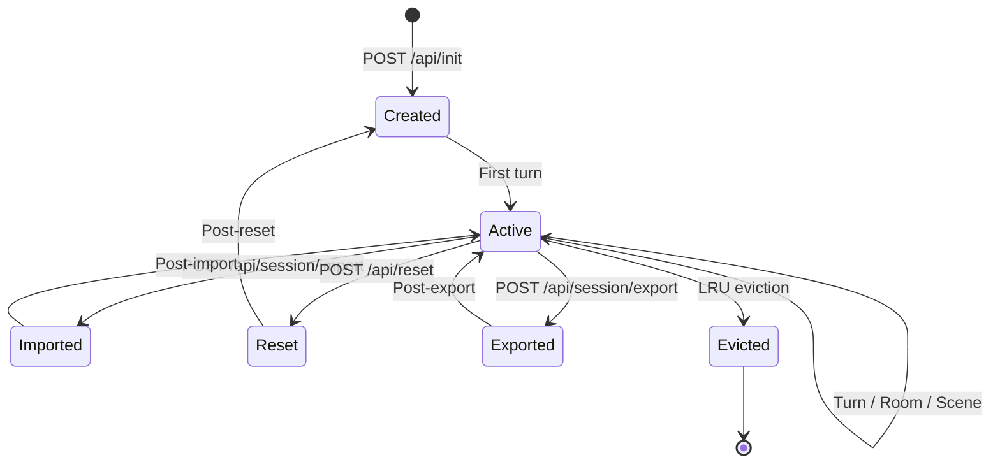
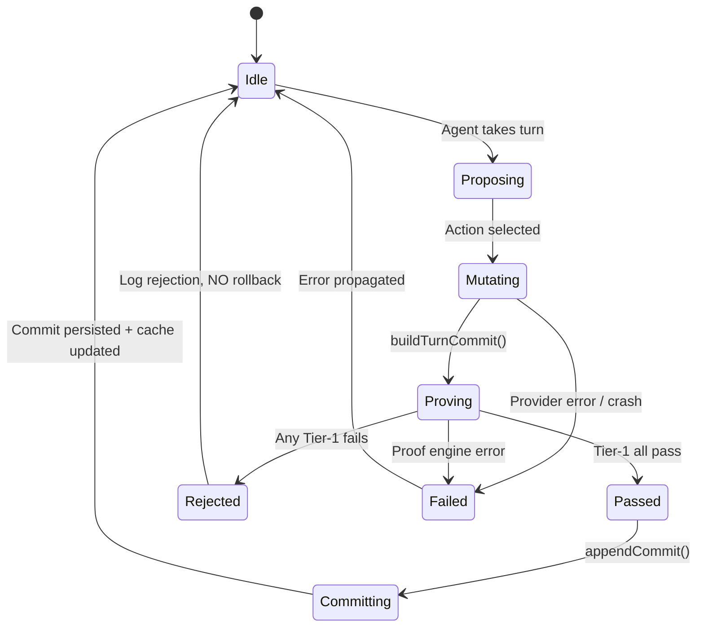
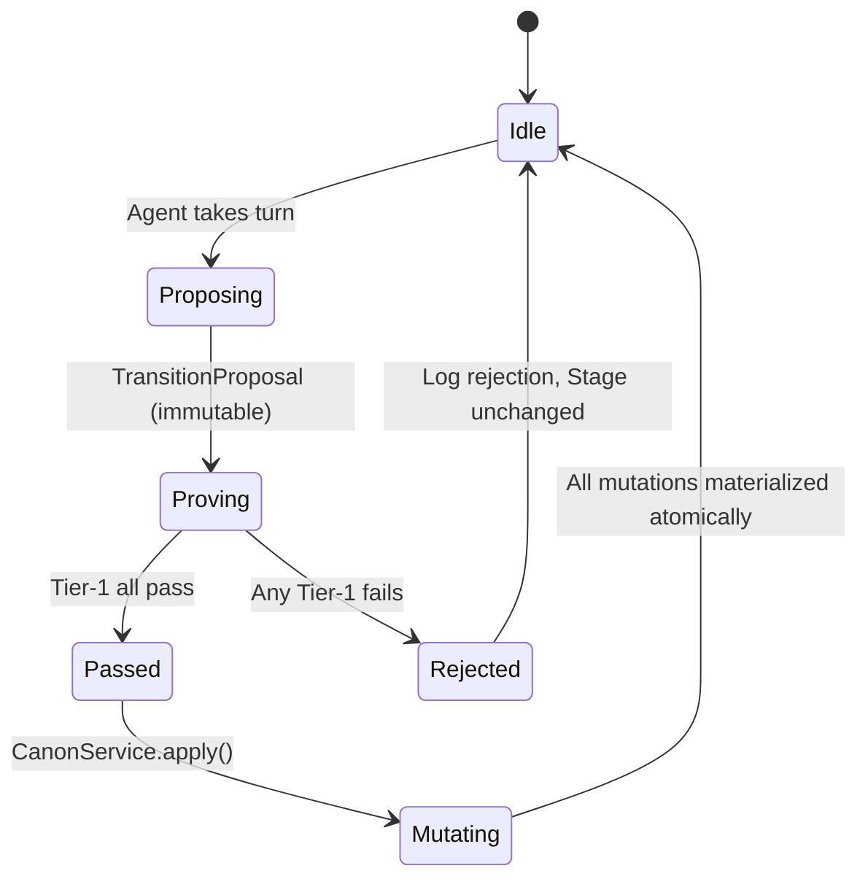
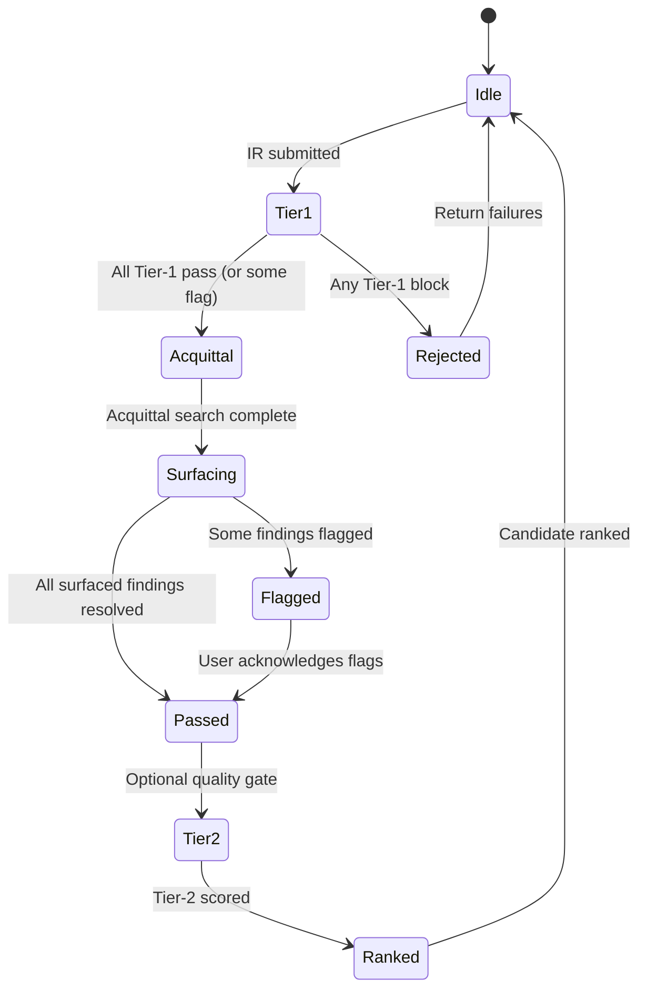
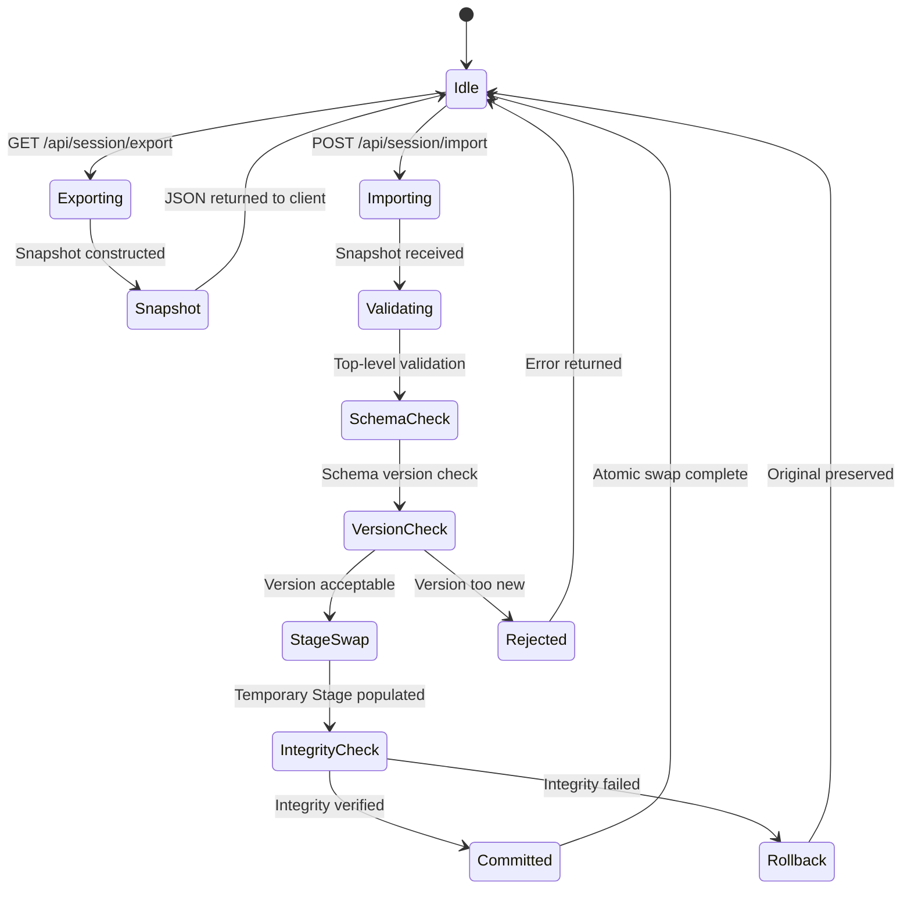
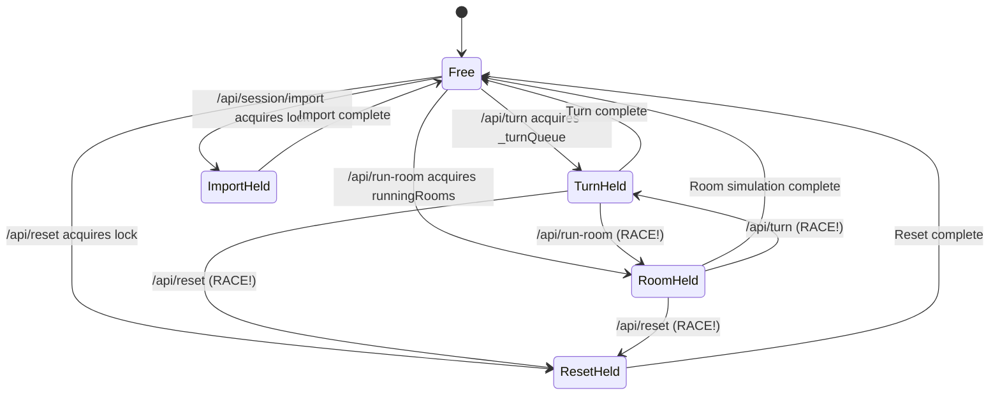
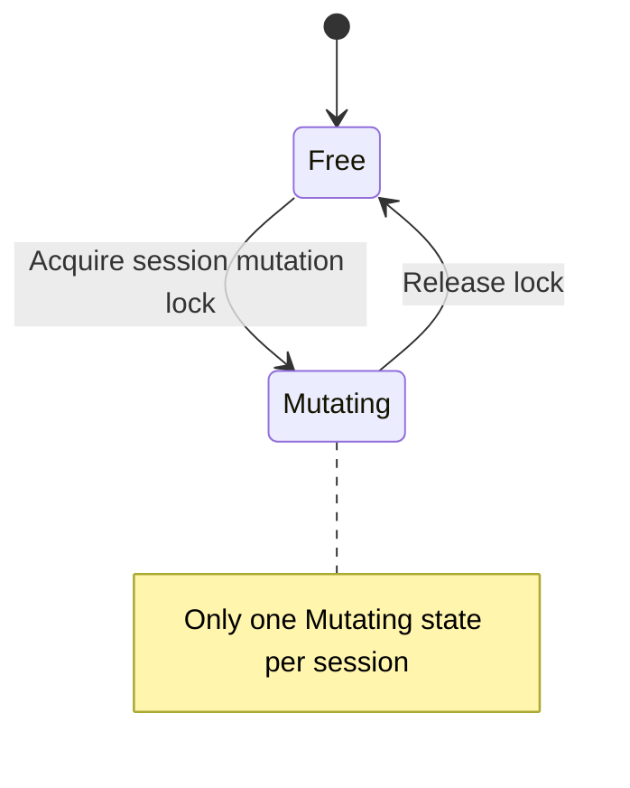
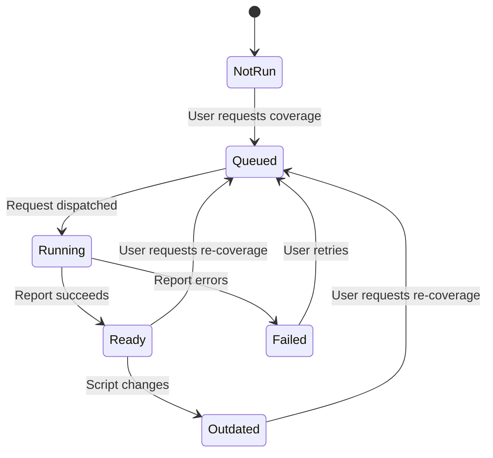

# STORYMACHINE — Formal Reliability Specification

*Companion to `SECURITY.md`. Produced 2026-07-15 (v2). This document is a
complete rewrite of the original reliability audit, upgraded from a prose-based
finding catalog to a formal reliability specification with temporal logic
invariants, state machine definitions, dependency analysis, blast radius
mapping, fault injection matrices, property-based test specifications, and
observability requirements.*

* Covers: proof correctness, persistence reliability, concurrency safety,
  resource management, graceful degradation, product-state accuracy,
  structural debt, and testing/CI gaps.
* Excludes: trust-boundary and deployment-safety issues (covered by
  `SECURITY.md`).

---

# §0 — Reading Guide and Formal Notation

## 0.1 Document Map

| Section | Content | Audience |
|---|---|---|
| §I | Formal Invariant System — every system-wide property as a named, categorized invariant | Engineers verifying fixes |
| §II | State Machine Catalog — explicit state machines for every critical lifecycle | Engineers implementing fixes |
| §III | Dependency Graph — which findings block which, critical path, fix ordering | Project managers, lead engineers |
| §IV | Findings — 50 findings across 8 categories, each with invariant reference, blast radius, fault injection, test spec, rollback | Everyone |
| §V | Blast Radius + Economic Impact — per-finding risk scoring | Leadership, prioritization |
| §VI | Fault Injection Matrix — systematic fault scenarios per finding | QA, verification engineers |
| §VII | Testing Strategy — property-based, fuzz, mutation, integration test specs | Test engineers |
| §VIII | Observability Specification — metrics, alerts, dashboards post-fix | SRE, ops |
| §IX | Rollback + Recovery Semantics — per-finding recovery plans | Release managers |
| §X | Repair Waves — ordered fix waves with formal entry/exit gates | Implementation teams |
| §XI | Global Completion Criteria — mechanical truth table | Auditors, reviewers |

## 0.2 Temporal Logic Notation

This document uses Linear Temporal Logic (LTL) to express invariants:

| Symbol | Meaning | Example |
|---|---|---|
| □P | "Always P" — P holds in every state | □(ProofPass → CommitExists) |
| ◇P | "Eventually P" — P holds in some future state | ◇(SessionReady) |
| P → Q | "P implies Q" — if P holds, Q must hold | Mutation → ProofPass |
| P ∧ Q | "P and Q" — both hold simultaneously | Canonical ∧ Consistent |
| P ∨ Q | "P or Q" — at least one holds | ImportSuccess ∨ ImportRejected |
| ¬P | "Not P" — P does not hold | ¬(StaleHead) |
| P U Q | "P until Q" — P holds until Q becomes true | Idle U TurnStarted |
| X P | "Next P" — P holds in the next state | X(Committed) after Passed |
| ∀x: P(x) | "For all x, P(x)" — universal quantification | ∀ commit: HasParent(commits) |
| ∃x: P(x) | "There exists x such that P(x)" | ∃ proof: Tier1Pass(proof) |

**Invariant categories:**

| Category | Meaning | Violation severity |
|---|---|---|
| **Safety** | "Something bad never happens" — □¬BadState | Always P0/P1 |
| **Liveness** | "Something good eventually happens" — ◇GoodState | Usually P1/P2 |
| **Integrity** | "Data is consistent across representations" — □Consistent(data) | P0–P2 depending on blast radius |

## 0.3 Finding Card Format

Every finding in §IV follows this structure:

```markdown
## <ID>: <Title>

| Field | Value |
|---|---|
| **Severity** | P0–P3 |
| **Confidence** | High / Medium / Low |
| **Category** | Correctness / Recovery / Concurrency / Resource / Degradation / UX / Debt / CI |
| **Invariant(s)** | INV-xxx (the formal property this violates) |
| **State Machine** | SM-xxx (which lifecycle this affects) |
| **Blast Radius** | User journeys affected |
| **Risk Score** | P × Impact × BlastRadius (§V) |

### Evidence
File path and line numbers.

### Why It Matters
Concrete failure scenario.

### Required Fix
The specific change, not a vague direction.

### Property-Based Test Specification
The property that must hold, expressed as a quick-check-style property.

### Fault Injection Scenario
The specific fault to inject and expected outcome (§VI).

### Rollback Plan
What to do if the fix itself introduces a regression.

### Observability
What metric/alert/dashpost is needed post-fix.
```

## 0.4 Mermaid State Diagram Conventions

State machines in §II use Mermaid `stateDiagram-v2` syntax:

- `[*]` = initial/final state
- `-->` = transition
- `state "label" as id` = named state
- `{}` = composite state
- Notes use `note right of State: text`

Guards are written as `[guard]` on transitions. Actions are written as `/ action` after guards.

## 0.5 Cross-Reference Conventions

- `SEC-xxx` refers to findings in `SECURITY.md`
- `COR-xxx`, `REC-xxx`, `CON-xxx`, `RES-xxx`, `DEG-xxx`, `UX-xxx`, `DEB-xxx`, `CI-xxx` refer to findings in this document
- `INV-xxx` refers to invariants in §I
- `SM-xxx` refers to state machines in §II
- File references use `path/to/file.ts:line` format

---

# §I — Formal Invariant System

## I.1 Invariant Registry

Every system-wide property that must hold is registered below. Each invariant
is categorized, assigned a formal LTL expression, and linked to the findings
that violate it.

### Safety Invariants (something bad must never happen)

| ID | Name | LTL | Category | Status | Violated By |
|---|---|---|---|---|---|
| INV-S1 | Proof Rejection Implies No Mutation | ∀ t: ¬ProofPass(t) → □(Stage(t+1) = Stage(t)) | Safety | **VIOLATED** | COR-001 |
| INV-S2 | Canonical Chain Linearity | ∀ c ∈ ledger: c.parentId ∈ ledger ∪ {null} ∧ ¬fork(c) | Safety | **VIOLATED** | COR-002, CON-003 |
| INV-S3 | Session Mutation Exclusion | □(at most one mutating command per session at any time) | Safety | **VIOLATED** | CON-001, CON-002 |
| INV-S4 | Import Cannot Destroy Valid Session | ∀ s: Import(malformed, s) → s unchanged | Safety | **VIOLATED** | REC-002, REC-010 |
| INV-S5 | Reset Requires Valid Backup | ∀ s: Reset(s) → ∃ backup: Verify(backup) = OK | Safety | **VIOLATED** | REC-003 |
| INV-S6 | No Unproven Commit Appears Proven | ∀ c ∈ ledger: c.origin = "director_cut" → DisplayedAs("override", c) | Safety | **VIOLATED** | COR-007 |
| INV-S7 | New Story Cannot Inherit Project | ∀ s: NewStory(s) → s.project_id ≠ prev.project_id | Safety | **SATISFIED** | — |
| INV-S8 | Generated Content Cannot Replace Screenplay | ∀ s: Simulate(s) → screenplay_unchanged(s) | Safety | **SATISFIED** | — |
| INV-S9 | Proof Rejection Cannot Advance Arc | ∀ arc: ¬ProofPass(scene) → rollingState unchanged | Safety | **VIOLATED** | COR-006 |
| INV-S10 | Session Identity Fails Closed | ∀ req: ¬HasIdentity(req) → 401 | Safety | **SATISFIED** | — |

### Liveness Invariants (something good must eventually happen)

| ID | Name | LTL | Category | Status | Violated By |
|---|---|---|---|---|---|
| INV-L1 | Turn Eventually Completes | ∀ turn: TurnStarted → ◇(TurnCompleted ∨ TurnFailed) | Liveness | **VIOLATED** | CON-004 |
| INV-L2 | Export-Import Round-Trip | ∀ s: ◇(Import(Export(s)) ≈ s) | Liveness | **VIOLATED** | REC-001, REC-007 |
| INV-L3 | Coverage Eventually Reports | ∀ request: ◇(ReportReady ∨ ReportFailed) | Liveness | **VIOLATED** | UX-001 |
| INV-L4 | Room Simulation Eventually Terminates | ∀ sim: ◇(SimCompleted ∨ SimAborted) | Liveness | **VIOLATED** | CON-004 |
| INV-L5 | Converge Eventually Produces Winner or Abstains | ∀ converge: ◇(Winner ∨ Abstained ∨ BudgetExhausted) | Liveness | **VIOLATED** | COR-005 |

### Integrity Invariants (data is consistent across representations)

| ID | Name | LTL | Category | Status | Violated By |
|---|---|---|---|---|---|
| INV-I1 | Enriched State Reflects All Commits | ∀ s: buildEnrichedState(s) = replay(all_non_reverted_commits(s)) | Integrity | **VIOLATED** | COR-003 |
| INV-I2 | Action_Log and StoryCommit Correspondence | ∀ action ∈ Action_Log: ∃ commit ∈ StoryCommit: MapsTo(action, commit) | Integrity | **VIOLATED** | COR-004 |
| INV-I3 | Orchestrator Head Matches Canonical Head | ∀ turn: orchestrator._lastCommitId = stage.canonicalHeadId | Integrity | **VIOLATED** | COR-002, CON-003 |
| INV-I4 | Schema Version Single Source | ∀ code: export_version = import_version = SCHEMA_VERSION | Integrity | **VIOLATED** | REC-001, DEB-005 |
| INV-I5 | Ghost Scores Persisted | ∀ ghost: ghost.composite_score ≠ null ∧ ghost.tension_score ≠ null | Integrity | **VIOLATED** | REC-009 |
| INV-I6 | Belief/Emotion Ownership Unambiguous | ∀ belief: owner(belief) ∈ {NarrativeState, Stage} ∧ ¬both | Integrity | **VIOLATED** | COR-003 |
| INV-I7 | Converge Commit Matches Selection | ∀ converge_commit: ir(commit) = ir(selected_candidate) | Integrity | **VIOLATED** | COR-008 |
| INV-I8 | Title-Page Consistent Across Exports | ∀ format: title_page(export_fountain) = title_page(export_fdx) = title_page(export_pdf) | Integrity | **VIOLATED** | UX-002 |
| INV-I9 | Command Availability Consistent | ∀ cmd: availability(toolbar, cmd) = availability(ship, cmd) | Integrity | **VIOLATED** | UX-003 |
| INV-I10 | Coverage Status Matches Actual State | ∀ status: status = "Ready" → ∃ report ∧ hash_matches(current, report) | Integrity | **VIOLATED** | UX-001 |
| INV-I11 | One Quality Authority | ∀ claim: claim.is_verdict → claim.source = deterministic | Integrity | **VIOLATED** | UX-004 |
| INV-I12 | No Cross-Tree Imports | ∀ import: ¬(src/** imports server/**) ∧ ¬(server/** imports src/**) | Integrity | **VIOLATED** | DEB-001 |
| INV-I13 | One Export Implementation Per Format | ∀ format: implementation_count(format) = 1 | Integrity | **VIOLATED** | DEB-002 |
| INV-I14 | Persona Isolation Across Sessions | ∀ s1, s2: s1 ≠ s2 → personas(s1) ∩ personas(s2) = ∅ | Integrity | **VIOLATED** | DEB-003 |
| INV-I15 | Full Session Export Is Actually Full | ∀ s: export(s).keys ⊇ all_bounded_contexts | Integrity | **VIOLATED** | REC-007 |

## I.2 Invariant Category Details

### Safety Invariants — Formal Proofs of Violation

#### INV-S1: Proof Rejection Implies No Mutation

**Statement:** ∀ t: ¬ProofPass(t) → □(Stage(t+1) = Stage(t))

**Interpretation:** When a turn's Tier-1 proof rejects the proposed transition,
no persistent state may change. The stage after rejection must be identical to
the stage before the turn began.

**Formal Witness (violation proof):**

```
Let t be a turn where proof rejects at action-to-ops.ts:472.
Stage mutations at Orchestrator.ts:252-386 include:
  - location update (line 258)
  - Action_Log INSERT (line 265)
  - CausalSpine.processEvent (line 270)
  - belief updates (lines 314-319)
  - emotion appraisals (lines 328-333)
  - director state mutation (lines 340-344)
  - illusion state mutation (lines 354-359)

buildTurnCommit at line 387 constructs IR.
action-to-ops.ts:472 runs Tier-1 proof → rejects → returns null.
buildTurnCommit returns null.
No rollback occurs.
Stage(t+1) ≠ Stage(t). □ violated.
```

**Root Cause:** Mutations are side effects during proposal generation, not
post-proof materialization. The architecture violates command-query separation:
the turn既是 a query (should this transition be allowed?) AND a command
(mutate state).

#### INV-S3: Session Mutation Exclusion

**Statement:** □(at most one mutating command per session at any time)

**Interpretation:** No two Stage-mutating commands (turn, room, scene, import,
reset, restore, canon commit) may execute concurrently for the same session.

**Formal Witness:**

```
Turn queue: session._turnQueue (game.ts:149) — promise-chain lock.
Room lock: runningRooms Set (game.ts:254) — advisory Set<string>.
These are independent mechanisms.

Let T = /api/turn acquiring _turnQueue.
Let R = /api/run-room acquiring runningRooms.
T and R can both hold their respective locks simultaneously.
Both write to the same Stage and Orchestrator.
Stage(t+R) ≠ Stage(t) after T's mutation → INV-S3 violated.
```

#### INV-S4: Import Cannot Destroy Valid Session

**Statement:** ∀ s: Import(malformed, s) → s unchanged

**Formal Witness:**

```
config.ts:339 calls destroySession(sid) BEFORE import.
config.ts:337-344: import iterates nested arrays with no wrapping transaction.
If import fails at Stage.ts:1377 (e.g., malformed belief edge),
the original session is already destroyed.
s no longer exists. INV-S4 violated.
```

### Liveness Invariants — Formal Proofs of Violation

#### INV-L1: Turn Eventually Completes

**Statement:** ∀ turn: TurnStarted → ◇(TurnCompleted ∨ TurnFailed)

**Formal Witness:**

```
game.ts:294-310: 5-minute timer fires, sets disconnected=true.
game.ts:319-357: route still awaits runRoomSimulation().
If provider hangs without closing TCP connection:
  - Timer fires (disconnected = true)
  - But simulation continues (no AbortSignal)
  - turn never completes or fails
  - ◇(TurnCompleted ∨ TurnFailed) never becomes true
```

#### INV-L2: Export-Import Round-Trip

**Statement:** ∀ s: ◇(Import(Export(s)) ≈ s)

**Formal Witness:**

```
Export (Stage.ts:1338-1371) omits:
  - Story_Commits (v8 table)
  - Ghost_Commits (v9 table)
  - Reveal_Plans (v10 table)
  - Drama_Positions (v11 table)
  - ScriptIDE_State (v13 table)

Import(Export(s)) produces s' where:
  - s'.canonical_history = ∅ (missing Story_Commits)
  - s'.screenplay = null (missing ScriptIDE_State)
  - s'.ghosts = ∅ (missing Ghost_Commits)
  s' ≉ s. INV-L2 violated.
```

### Integrity Invariants — Formal Proofs of Violation

#### INV-I1: Enriched State Reflects All Commits

**Statement:** ∀ s: buildEnrichedState(s) = replay(all_non_reverted_commits(s))

**Formal Witness:**

```
enrichedState.ts:20-46:
  1. Replays all non-reverted commits → accumulated state
  2. Then: characterBeliefs = live.characterBeliefs (from Stage)
  3. Then: characterEmotions = live.characterEmotions (from Stage)

If a Converge path commits an UPDATE_BELIEF op but does not
materialize it into Stage's Character_State table, then:
  - replayed_state.beliefs contains the update
  - live.beliefs does NOT contain the update
  - live overwrites replayed
  - The belief change is canonical but invisible.
  INV-I1 violated.
```

#### INV-I3: Orchestrator Head Matches Canonical Head

**Statement:** ∀ turn: orchestrator._lastCommitId = stage.canonicalHeadId

**Formal Witness:**

```
Director's Cut (commits.ts:60) appends a commit directly to Stage.
Converge selection (commits.ts:109) appends a commit directly to Stage.
Live author (live.ts:141) appends a commit directly to Stage.

None of these routes update orchestrator._lastCommitId.
orchestrator._lastCommitId = old_head.
stage.canonicalHeadId = new_head.
old_head ≠ new_head. INV-I3 violated.
```

---

# §II — State Machine Catalog

## SM-1: Session Lifecycle



**States:**

| State | Description | Stage DB | Orchestrator |
|---|---|---|---|
| Created | Session ID registered, no data | Initialized | Not created |
| Active | Normal operation, turns mutating state | Open | Running |
| Imported | Import in progress | Being replaced | Being recreated |
| Reset | Reset in progress | Being destroyed | Being destroyed |
| Exported | Export in progress (read-only) | Open | Idle |
| Evicted | Session removed from memory | Closed | Destroyed |

**Transitions and Guards:**

| From | To | Guard | Action | Findings |
|---|---|---|---|---|
| Created → Active | Session exists | Create Orchestrator | — |
| Active → Imported | Valid import request | **Must acquire mutation lock** | CON-002 |
| Active → Reset | Valid reset request | **Must acquire mutation lock + valid backup** | CON-002, REC-003 |
| Imported → Active | Import complete + integrity check | Re-register agents, rebuild Orchestrator | REC-010 |
| Reset → Active | Reset complete | Fresh Stage + fresh Orchestrator | REC-003 |

**Invariant:** □(Active → at most one Orchestrator) ∧ □(Import|Reset → no concurrent Active)

---

## SM-2: Turn Execution



**Critical Observation:** The current implementation has `Mutating` BEFORE
`Proving`. This is the root cause of COR-001. The correct flow should be:



**Invariant:** □(¬ProofPass → ¬Mutate) — safety, violated by COR-001.

---

## SM-3: Proof Gate



**States:**

| State | Description | Tier | Can Block? |
|---|---|---|---|
| Tier1 | 8 hard-block proofs (causal, mechanism, continuity, temporal, intentional, epistemic, provenance, earnedReveal) | 1 | Yes |
| Acquittal | Adversarial innocent-explanation search | — | Yes (acquits false positives) |
| Surfacing | Single release gate for finding-surfacing | — | Yes |
| Tier2 | 6 quality-gate proofs (necessity, specificity, dialogue, polarity, reincorporation, characterAgency) | 2 | No (flag only) |
| Tier3 | 2 ranking-signal proofs (genericness, originality) | 3 | No (rank only) |
| Tier4 | 2 ethics proofs (attribution, biasAudit) | 4 | No (monitor only) |

**Invariant:** □(Tier1Block → ¬Commit) — safety, currently VIOLATED by COR-007 (Director's Cut bypasses proof).

---

## SM-4: Import/Export Round-Trip



**Critical Path:** VersionCheck → Rejected is currently broken (REC-001: hardcoded to v6 instead of v13). StageSwap → Committed is not atomic (REC-010: no wrapping transaction).

**Invariant:** □(Importing → ¬Destroyed(original)) — safety, violated by REC-002.

---

## SM-5: Concurrency (Turn vs Room vs Import)



**The RACE states are violations.** The correct model is:



**Invariant:** INV-S3 — □(at most one Mutating per session). Currently VIOLATED by CON-001, CON-002.

---

## SM-6: Coverage Status



**States:**

| State | Toolbar Display | Has Report? | Hash Matches? |
|---|---|---|---|
| NotRun | "Not run" | No | — |
| Queued | "Queued" | No | — |
| Running | "Running" | No | — |
| Ready | "Ready" | Yes | Yes |
| Outdated | "Outdated" | Yes | No |
| Failed | "Failed" | No | — |

**Invariant:** INV-I10 — □(status = "Ready" → ∃ report ∧ hash_matches). Currently VIOLATED by UX-001.

---

# §III — Dependency Graph and Critical Path

## III.1 Finding Dependency DAG

The following directed acyclic graph (DAG) maps prerequisite relationships
between findings. An arrow `A → B` means "A must be fixed before B can be
correctly fixed." Root causes (no incoming edges) are the highest-leverage
fix targets.

```
ROOT CAUSES (no prerequisites):
  CON-001 (Turn/Room share no lock)
  CON-002 (Import/Reset bypass turn queue)
  COR-001 (Mutations survive proof rejection)
  REC-003 (Reset backup not WAL-safe)
  REC-001 (Export/import schema version mismatch)
  DEB-005 (Schema version in two places)
  DEB-001 (Frontend imports backend)

DEPENDS ON CON-001/CON-002 (session coordinator):
  COR-004 (Room actions lost from canon)
  COR-006 (Arc advances through rejected transitions)
  REC-004 (Reset/import race async work)
  REC-005 (Turn interleaves with room/scene)
  CON-003 (Director's Cut bypasses Orchestrator)
  CON-004 (Room timeout doesn't cancel)

DEPENDS ON COR-001 (atomic proof+commit):
  COR-002 (Orchestrator stale head)
  COR-003 (buildEnrichedState discards belief ops)
  COR-005 (Converge SSE no mechanisms)
  COR-007 (Director's Cut bypasses proof)
  COR-008 (Converge commit re-proves reduced IR)
  COR-009 (Non-atomic turn execution)

DEPENDS ON REC-001 (schema version single source):
  REC-002 (Malformed import destroys session)
  REC-007 (Full snapshot not full)
  REC-008 (Empty valid export rejected)
  REC-010 (Import non-atomic)

DEPENDS ON CON-002 (mutation coordinator):
  REC-006 (Room timeout doesn't cancel)

DEPENDS ON DEB-001 (shared contracts):
  DEB-002 (Export logic duplicated)
  UX-002 (Title-page metadata not persisted)
  UX-003 (Duplicate command surfaces disagree)

DEPENDS ON COR-003 (belief/emotion ownership):
  COR-010 (ADD_FACT idempotency)

DEPENDS ON REC-002 (atomic import):
  REC-010 (Import non-atomic)

INDEPENDENT (can be fixed in any order):
  UX-001 (Coverage status)
  UX-004 (Two quality authorities)
  UX-005 (Legacy Ship surface)
  UX-006 (Accessibility)
  DEB-003 (Persona registry)
  DEB-004 (Orphaned NarrativeState)
  DEB-006 (Build chunk size)
  RES-001–005 (Resource management)
  DEG-001–004 (Degradation)
  CI-001–007 (Testing gaps)
  REC-009 (Ghost scores)
```

## III.2 Critical Path

The longest dependency chain determines the minimum time to full repair:

```
CON-001/CON-002 (session coordinator)
  → COR-001 (atomic proof+commit, depends on coordinator)
    → COR-002 (stale head, depends on atomic commit)
      → COR-003 (belief ownership, depends on correct head)
        → COR-010 (idempotency, depends on belief ownership)
    → COR-007 (Director's Cut proof, depends on atomic commit)
      → COR-008 (Converge commit, depends on Director's Cut proof)
  → REC-004 (async race, depends on coordinator)
    → CON-004 (timeout cancellation, depends on async safety)

REC-001 (schema version)
  → REC-002 (atomic import)
    → REC-010 (import non-atomic)

DEB-001 (shared contracts)
  → DEB-002 (export consolidation)
    → UX-002 (title-page persistence)
```

**Critical path length: 6 hops** (CON-001 → COR-001 → COR-002 → COR-003 → COR-010).

**Minimum parallel workstreams: 3** (session coordinator path, schema/import path, shared contracts path).

## III.3 Fix Ordering Constraints

| Wave | Dependencies | Can Parallelize Within Wave? |
|---|---|---|
| W0: Evidence freeze | None | Yes — all findings independently |
| W1: Session coordinator | CON-001, CON-002 | No — single implementation |
| W2: Atomic proof+commit | W1 complete | Yes — COR-001, COR-009 |
| W3: Proof integrity | W2 complete | Yes — COR-002–008, CON-003 |
| W4: Recovery + import | REC-001, REC-003 | Yes — REC-001–010 |
| W5: Resource bounds | None (independent) | Yes — RES-001–005 |
| W6: Product truth | DEB-001 (partial) | Yes — UX-001–006 |
| W7: Architecture | DEB-001 | Yes — DEB-001–006 |
| W8: CI + observability | All above | Yes — CI-001–007 |

---

# §IV — Findings

## Finding Count Summary

| Category | ID Range | Count | P0 | P1 | P2 | P3 |
|---|---|---|---|---|---|---|
| Correctness | COR-001–010 | 10 | 1 | 6 | 3 | 0 |
| Recovery | REC-001–010 | 10 | 3 | 4 | 3 | 0 |
| Concurrency | CON-001–004 | 4 | 1 | 3 | 0 | 0 |
| Resource Management | RES-001–005 | 5 | 0 | 0 | 3 | 2 |
| Degradation | DEG-001–004 | 4 | 0 | 1 | 3 | 0 |
| Product Behavior | UX-001–006 | 6 | 0 | 0 | 6 | 0 |
| Architecture Debt | DEB-001–006 | 6 | 0 | 0 | 1 | 5 |
| Testing Gaps | CI-001–007 | 7 | 0 | 0 | 0 | 7 |
| **Total** | | **52** | **5** | **14** | **19** | **14** |

---

# Part A — Correctness (proof and canonical state)

## COR-001: Stage mutations survive proof rejection

| | |
|---|---|
| **Severity** | P0 |
| **Confidence** | High |
| **Category** | Correctness |
| **Invariant(s)** | INV-S1 (Proof Rejection Implies No Mutation) |
| **State Machine** | SM-2 (Turn Execution) — violation at Mutating→Proving transition |
| **Blast Radius** | Every OASIS turn, room simulation, Converge, Director's Cut, live-author |
| **Risk Score** | See §V |

### Evidence

`server/engine/Orchestrator.ts:252-386` — `runTurn()` begins. Location is
updated. Action_Log rows are inserted. Spine events are appended. Beliefs
and emotions are recalculated. Director state is modified.

`server/engine/Orchestrator.ts:387` — `buildTurnCommit()` constructs the
StoryOps from the agent's output.

`server/nvm/bridge/action-to-ops.ts:472` — The bridge function folds the
agent's action into typed StoryOps and runs Tier-1 proof.

When proof rejects the transition, `buildTurnCommit()` returns `null`.
The null commit is logged, but all Stage mutations from lines 252-386
remain.

### Why It Matters

The writer is watching a simulation that has moved. The canonical ledger
has not accepted the move. The next OASIS turn will parent off a head that
does not match what the user just saw. Beliefs, emotions, location, and
Action_Log rows all describe a story that canon does not recognize.

Over multiple turns, the divergence compounds. The simulation drifts
further from the ledger. What-If analysis, Converge, and projection
replay all operate on an inconsistent foundation.

### Required Fix

Agent output must produce a **transition proposal** (intent), not a side
effect. No persistent Stage method may run during proposal generation.

```text
Agent reasoning
→ TransitionProposal (immutable, contains action + computed ops + proof receipt)

If proof passes:
  → CanonService.apply(proposal)
    → atomic {append StoryCommit + materialize projections}
    → update head
    → publish event

If proof fails:
  → log rejection
  → return error to caller
  → Stage unchanged
```

The key rule: **no mutation survives a failed proof.**

### Property-Based Test Specification

```typescript
// Property: for any turn, if proof rejects, Stage is identical before and after
fc.assert(
  fc.property(
    validSessionArbitrary,
    rejectedActionArbitrary,
    (session, action) => {
      const before = snapshotStage(session);
      driveTurn(session, action); // proof rejects
      const after = snapshotStage(session);
      return deepEqual(before, after);
    }
  ),
  { numRuns: 1000 }
);
```

### Fault Injection Scenario

Inject a proof engine that rejects every transition. Run 100 turns.
Assert: Stage snapshot at turn 100 equals Stage snapshot at turn 0.
Assert: Zero new StoryCommit rows. Assert: Zero new Action_Log rows.

### Rollback Plan

If the atomic proof+commit fix introduces regressions:
1. Revert to the side-effect model but add a compensation transaction
   that undoes Stage mutations on proof rejection.
2. This is a temporary bridge — the full fix (proposal → proof → apply)
   is the target.

### Observability

- **Metric:** `proof_rejection_rollback_count` — count of proof rejections
  that required Stage rollback (should be 0 after fix).
- **Alert:** If rollback count > 0 for 5 minutes, the fix has regressed.
- **Dashboard:** Proof rejection rate vs. rollback rate divergence.

---

## COR-002: Orchestrator cache uses a stale head

| | |
|---|---|
| **Severity** | P1 |
| **Confidence** | High |
| **Category** | Correctness |
| **Invariant(s)** | INV-S2 (Canonical Chain Linearity), INV-I3 (Orchestrator Head = Canonical Head) |
| **State Machine** | SM-2 (Turn Execution) — parentId construction uses stale head |
| **Blast Radius** | Any turn following a Director's Cut, Converge, or live-author commit |

### Evidence

`server/engine/Orchestrator.ts:181` — Constructor initializes `_lastCommitId`
and `_narrativeState` from Stage.

`server/engine/Orchestrator.ts:419` — After a successful turn, the Orchestrator
updates its cache.

`server/engine/Orchestrator.ts:694` — After a successful room simulation,
the Orchestrator updates its cache.

But these routes write commits independently:
- Director's Cut: `server/routes/nvm/commits.ts:60`
- Converge selection: `server/routes/nvm/commits.ts:109`
- Live author: `server/routes/nvm/live.ts:141`

None of these routes notify or refresh the Orchestrator.

### Why It Matters

A Director's Cut commit persists a new head. The next OASIS turn asks
the Orchestrator for `_lastCommitId`. It returns the old value. The turn
constructs a StoryCommit with the wrong parent. Proof may still pass (if
the parent is close enough), but the chain is now forked or skips a
commit. Replay cannot reproduce the simulation.

### Required Fix

**Option 1 (recommended):** Remove the Orchestrator's private cache.
Request current head from Stage or `CanonService` on every command.

**Option 2:** Version the cache. Cache key = `(sessionId, sessionGeneration,
canonicalHeadId)`. Invalidated only by `CanonService`. Mismatch forces
deterministic replay.

### Property-Based Test Specification

```typescript
fc.assert(
  fc.property(
    sessionWithTurnArbitrary,
    directorCutOpsArbitrary,
    (session, ops) => {
      driveTurn(session, /* normal action */);
      const headBefore = session.orchestrator._lastCommitId;
      injectDirectorCut(session, ops);
      const headAfter = session.orchestrator._lastCommitId;
      return headAfter === session.stage.canonicalHeadId;
    }
  )
);
```

### Fault Injection Scenario

1. Create session, perform OASIS turn (commits A).
2. Through Director's Cut, append commit B.
3. Perform another OASIS turn.
4. Assert the second turn's parent is B, not A.
5. Assert canonical chain is linear: A → B → C.

### Rollback Plan

If cache removal causes performance regression, reinstate with generation
tracking: `cacheGeneration++` on every external commit write. Turn checks
`cacheGeneration` before using cached head; mismatch forces fresh read.

### Observability

- **Metric:** `orchestrator_cache_hit_rate` — should approach 1.0 after fix
  (fresh read = cache miss, which is now the correct behavior).
- **Metric:** `orchestrator_stale_head_detected` — count of stale head
  detections (should be 0 after fix).

---

## COR-003: `buildEnrichedState` discards NVM belief and emotion operations

| | |
|---|---|
| **Severity** | P1 |
| **Confidence** | High |
| **Category** | Correctness |
| **Invariant(s)** | INV-I1 (Enriched State Reflects All Commits), INV-I6 (Belief/Emotion Ownership) |
| **State Machine** | SM-2 — enriched state reconstruction uses live Stage values for beliefs |
| **Blast Radius** | What-If, Converge, projection, next Converge run |

### Evidence

`server/nvm/state/enrichedState.ts:20-46` — Replays all non-reverted
StoryCommits to reconstruct NarrativeState. Then overwrites with:

```ts
characterBeliefs: live.characterBeliefs,    // from Stage
characterEmotions: live.characterEmotions,  // from Stage
```

Converge, Director's Cut, and live-author paths append StoryOps that
include belief and emotion changes, but those changes are never
materialized into Stage's Character_State table.

### Why It Matters

A Converge path commits an UPDATE_BELIEF op. The commit is accepted and
appended to the ledger. The next call to `buildEnrichedState()` replays
the commit, reconstructs the belief, then overwrites it with the Stage
value (which was never updated). The belief change is canonical but
invisible. The writer's decision has no effect.

### Required Fix

Choose one authority:
- **NarrativeState** (folded from StoryCommits) owns beliefs and emotions.
- Stage belief/emotion tables are materialized indexes only.
- `buildEnrichedState()` does not overwrite folded state with Stage values.
- Delete the overwrite line. Update Stage only through `CanonService`.

### Property-Based Test Specification

```typescript
fc.assert(
  fc.property(
    sessionWithBeliefArbitrary,
    convergeBeliefUpdateArbitrary,
    (session, update) => {
      injectConvergeBeliefUpdate(session, update);
      const enriched = buildEnrichedState(session.stage);
      return enriched.characterBeliefs[update.charId]
        .contains(update.newBelief);
    }
  )
);
```

### Fault Injection Scenario

1. Create session with Agent A having belief B1.
2. Through Converge, append UPDATE_BELIEF changing B1 → B2.
3. Call buildEnrichedState().
4. Assert characterBeliefs[A] contains B2.
5. Revert the commit.
6. Assert characterBeliefs[A] contains B1.

### Rollback Plan

If removing the overwrite breaks existing belief flows that rely on
Stage as authority, add a migration step: `materializeAllBeliefs()` that
writes NarrativeState beliefs back to Stage after each CanonService.apply.

### Observability

- **Metric:** `enriched_state_belief_overwrite_count` — should be 0 after fix.
- **Alert:** If overwrite count > 0, the fix has regressed.

---

## COR-004: Room simulation is a lossy compiler from actions to commits

| | |
|---|---|
| **Severity** | P1 |
| **Confidence** | High (static analysis) |
| **Category** | Correctness |
| **Invariant(s)** | INV-I2 (Action_Log and StoryCommit Correspondence) |
| **State Machine** | SM-2 — round-end commit loses intermediate actions |
| **Blast Radius** | Replay fidelity, What-If analysis, writer ledger review |

### Evidence

`server/engine/Orchestrator.ts:662` — The round-end bridge compiles the
final action into a StoryCommit. Earlier actions in the round are lost
from canon.

`server/engine/Orchestrator.ts:485-500` — Successful relocation records
the action and breaks the round early.

`server/engine/Orchestrator.ts:599-604` — The round-end bridge is gated
by `!didRelocate`. When relocation occurs, the round skips StoryCommit
construction entirely.

### Why It Matters

Action_Log records every action. StoryCommit may contain none of them
(if relocation occurred) or only the last one (if multiple actions were
performed). The two histories diverge. Replay of StoryCommits cannot
reproduce the simulation.

### Required Fix

**Option A — One commit per action:**
Each action becomes its own StoryCommit with its own parent. Best
auditability. Highest commit count.

**Option B — One atomic round commit:**
The round commit contains an ordered list of all transitions. Proved as
a unit. Intermediate actions are represented as ops within the commit.

Do not retain the implicit "representative action" model.

### Property-Based Test Specification

```typescript
fc.assert(
  fc.property(
    roomSessionArbitrary,
    agentCountArbitrary,
    (session, n) => {
      const result = runRoomSimulation(session, n);
      const actionCount = result.actionLog.length;
      const commitOps = result.commits.flatMap(c => c.ops);
      return commitOps.length >= actionCount; // every action mapped
    }
  )
);
```

### Fault Injection Scenario

1. Set up room with 3 agents who will each act.
2. Run simulation.
3. Count Action_Log entries (expect ≥3).
4. Count StoryCommit ops (expect matching).
5. Replay commits → assert they reproduce Action_Log sequence.

### Rollback Plan

If one-commit-per-action creates excessive commit count, implement
compaction: merge consecutive same-agent commits within a round into
a single atomic commit with ordered ops.

### Observability

- **Metric:** `action_commit_ratio` — Action_Log count / StoryCommit op
  count. Should be exactly 1.0 after fix.
- **Alert:** If ratio < 0.9 for 5 minutes, actions are being lost.

---

## COR-005: Production Converge SSE supplies no mechanisms

| | |
|---|---|
| **Severity** | P1 |
| **Confidence** | High (static analysis) |
| **Category** | Correctness |
| **Invariant(s)** | INV-L5 (Converge Eventually Produces Winner or Abstains) |
| **State Machine** | SM-3 — Tier1 blocks all candidates because mechanism list is empty |
| **Blast Radius** | Converge feature (never produces a winner in production) |

### Evidence

`server/routes/nvm/converge.ts:164` — `activeMechanisms: []`

`server/nvm/proof/tier1/mechanism.ts:11-34` — Hard-blocks empty mechanism
list. No candidate can pass Tier-1 without at least one mechanism.

`src/components/ConvergePanel.tsx:252-286` — UI does not send mechanism
selector on SSE request.

### Why It Matters

The production streaming Converge path appears incapable of producing a
Tier-1 winner. Every candidate is rejected. The loop runs through its
budget, produces ghosts, and returns no winner. The writer sees a Converge
that never converges.

### Required Fix

Derive mechanisms deterministically from state and candidate. Or require
the user to supply mechanisms via UI. Or abstain with a precise reason.

### Property-Based Test Specification

```typescript
fc.assert(
  fc.property(
    convergeSessionArbitrary,
    candidateArbitrary,
    (session, candidate) => {
      const result = driveConvergeSSE(session, candidate);
      return result.winner !== null || result.abstained !== null;
      // never returns "no winner, no abstention"
    }
  )
);
```

### Fault Injection Scenario

1. Drive actual Converge SSE endpoint with production request shape.
2. Assert either a valid mechanism-backed winner or explicit abstention.
3. Assert no candidate passes Tier-1 without an active mechanism.

### Rollback Plan

If mechanism derivation introduces false negatives, add a "catch-all"
mechanism that satisfies the Tier-1 gate for any transition that changes
objective state.

### Observability

- **Metric:** `converge_winner_rate` — fraction of converge runs that
  produce a winner. Should be > 0 after fix.
- **Metric:** `converge_abstention_rate` — fraction that explicitly abstain.
- **Alert:** If winner_rate = 0 and abstention_rate = 0 for 10 runs,
  the fix has regressed.

---

## COR-006: Arc convergence advances through rejected fallback transitions

| | |
|---|---|
| **Severity** | P1 |
| **Confidence** | High (static analysis) |
| **Category** | Correctness |
| **Invariant(s)** | INV-S9 (Proof Rejection Cannot Advance Arc) |
| **State Machine** | SM-3 — arc compiler unconditionally applies null-winner IR |
| **Blast Radius** | Multi-scene arc convergence |

### Evidence

`server/nvm/converge/loop.ts:462-515` — When budget exhausted,
`convergeScene()` may return an IR even when `winner` is `null`.

`server/routes/nvm/converge.ts:303-344` — Arc compiler unconditionally
applies returned IR to `rollingState`.

### Why It Matters

A scene that fails to produce any proven candidate silently advances the
arc. The next scene evaluates against an unproven state. The entire arc
can progress through a chain of rejected transitions.

### Required Fix

When `winner === null`, the arc must not advance rolling state.
Produce exactly one outcome:
```ts
type ArcSceneResult =
  | { kind: "accepted"; transition: NarrativeTransitionIR; proof: ProofReceipt }
  | { kind: "abstained"; reason: string }
  | { kind: "budget_exhausted"; candidates: GhostCandidate[] }
  | { kind: "requires_author_decision"; candidates: GhostCandidate[] }
  | { kind: "cancelled" }
  | { kind: "provider_failed"; error: string };
```

### Property-Based Test Specification

```typescript
fc.assert(
  fc.property(
    arcSessionArbitrary,
    failingCandidateGeneratorArbitrary,
    (session, gen) => {
      const result = driveArc(session, gen); // all candidates fail Tier-1
      return result.rollingStateHash === session.initialHash;
    }
  )
);
```

### Fault Injection Scenario

1. Construct 3-scene arc.
2. Mock candidate generator to produce candidates that all fail Tier-1.
3. Drive arc.
4. Assert rollingState hash identical before and after each scene.
5. Assert no accepted commit created.
6. Assert explicit "abstained" or "budget_exhausted" result.

### Rollback Plan

If arc behavior changes break existing arc flows, add a compatibility
mode: `arcAdvanceOnRejection: true` flag that restores old behavior
with a deprecation warning.

### Observability

- **Metric:** `arc_unproven_advance_count` — should be 0 after fix.
- **Alert:** If > 0, the fix has regressed.

---

## COR-007: Director's Cut bypasses proof kernel

| | |
|---|---|
| **Severity** | P1 |
| **Confidence** | High |
| **Category** | Correctness |
| **Invariant(s)** | INV-S6 (No Unproven Commit Appears Proven) |
| **State Machine** | SM-3 — commit route bypasses Tier-1 entirely |
| **Blast Radius** | Ledger integrity, audit trail, replay fidelity |

### Evidence

`server/routes/nvm/commits.ts:60-95` — `POST /api/nvm/inject-ops`:
1. Validates StoryOp structure (well-formedness).
2. Applies operations to calculate response hash.
3. Appends commit directly to ledger.
No Tier-1 proof is run. The commit appears indistinguishable from a
proven commit.

### Why It Matters

If Director's Cut is an author override, the bypass may be intentional.
But the current implementation creates unmarked overrides — there is no
record of who authorized the bypass, why, or which proof checks failed.

### Required Fix

**Model A — Proof required:** Run Tier-1 on Director's Cut ops. Reject
if proof fails.

**Model B — Explicit author override:**
```ts
interface AuthorOverrideCommit {
  origin: "director_cut";
  authorId: string;
  reason: string;
  attemptedProof: ProofReceipt;
  acknowledgedFailures: ProofFailure[];
  timestamp: string;
}
```

Persist in commit record. Display differently. Required in audit trails.

### Property-Based Test Specification

```typescript
fc.assert(
  fc.property(
    directorCutSessionArbitrary,
    opsArbitrary,
    (session, ops) => {
      const result = injectDirectorCut(session, ops);
      if (result.proofFails) {
        return result.commit.origin === "director_cut"
          && result.commit.acknowledgedFailures.length > 0;
      }
      return true;
    }
  )
);
```

### Fault Injection Scenario

1. Submit Director's Cut ops that pass Tier-1 → assert origin recorded.
2. Submit Director's Cut ops that fail Tier-1 → assert override with
   acknowledged failures.
3. Assert no Director's Cut commit labeled as "proven."

### Rollback Plan

If proof requirement blocks legitimate Director's Cut use, fall back to
Model B (explicit override) with mandatory reason field.

### Observability

- **Metric:** `directors_cut_override_count` — number of proof bypasses.
- **Metric:** `directors_cut_proof_pass_rate` — fraction that pass proof.
- **Alert:** If override_count > 10/hour, writer is circumventing proof.

---

## COR-008: Converge commit re-proves a reduced approximation

| | |
|---|---|
| **Severity** | P1 |
| **Confidence** | High |
| **Category** | Correctness |
| **Invariant(s)** | INV-I7 (Converge Commit Matches Selection) |
| **State Machine** | SM-3 — commit-time proof uses different IR than selection-time |
| **Blast Radius** | Converge selection fidelity |

### Evidence

`server/routes/nvm/commits.ts:119-151` — Commit route reconstructs
incomplete shell IR:
- Hard-coded `sceneFunction: 'advance_plot'`
- No candidate `causalLinks`
- Empty postconditions
- No candidate identity

### Why It Matters

Selection-time proof validates the full candidate. Commit-time proof
validates a reduced approximation. A candidate rejected under full proof
can pass reduced commit-time proof.

### Required Fix

Persist the complete candidate IR when selected. At commit time,
re-prove the exact same IR against the current head.

### Property-Based Test Specification

```typescript
fc.assert(
  fc.property(
    convergeSessionArbitrary,
    candidateArbitrary,
    (session, candidate) => {
      const selected = driveConverge(session, candidate);
      const committed = commitCandidate(session, selected);
      return irHash(committed) === irHash(selected);
    }
  )
);
```

### Fault Injection Scenario

1. Drive Converge to produce candidate with specific causal links.
2. Select for commit.
3. Assert persisted commit contains exact same causal links.
4. Modify causal links → assert commit-time proof fails.

### Rollback Plan

If full-IR re-prove breaks existing commits, add a migration that
backfills missing IR fields from ghost ledger entries.

### Observability

- **Metric:** `converge_ir_drift_count` — commits where IR differs from
  selection. Should be 0 after fix.

---

## COR-009: Non-atomic turn execution leaves partial state on crash

| | |
|---|---|
| **Severity** | P0 |
| **Confidence** | High |
| **Category** | Correctness |
| **Invariant(s)** | INV-S1 (Proof Rejection Implies No Mutation — extended) |
| **State Machine** | SM-2 — crash between Mutating steps leaves partial state |
| **Blast Radius** | Every turn, every session |

### Evidence

`server/engine/Orchestrator.ts:252-424` — `runTurn()` performs:
1. `recordAction()` → Action_Log INSERT
2. `processEvent()` → CausalSpine mutation
3. `processExamine()` → potential lie-reveal
4. `updateEpistemics()` → Theory-of-Mind UPDATE
5. Appraisals → emotion UPDATE
6. Director evaluation → illusion state UPDATE
7. `buildTurnCommit()` → IR construction + proof
8. `appendCommit()` → StoryCommit INSERT

None of these are wrapped in a single SQLite transaction. If the server
crashes after step 1 but before step 8, the Action_Log entry exists but
no StoryCommit records it. The turn is half-applied.

### Why It Matters

A crash (or OOM, or unhandled rejection) mid-turn leaves the database in
a state where Action_Log and StoryCommit are inconsistent. The next turn
cannot recover because it doesn't know which actions were committed to
canon and which were orphaned.

### Required Fix

Wrap the entire turn in `Stage.db.transaction()`:

```ts
const commit = this.stage.db.transaction(() => {
  this.stage.recordAction(action);
  this.stage.processEvent(spineEvent);
  this.stage.updateEpistemics(tomDelta);
  this.stage.appraiseEmotions(appraisalInputs);
  this.stage.updateIllusionState(directorUpdates);
  return this.stage.appendCommit(commit);
});
```

### Property-Based Test Specification

```typescript
// Simulate crash after step N, assert consistency
for (let crashAfter = 1; crashAfter <= 8; crashAfter++) {
  const session = createSession();
  crashTurnAtStep(session, crashAfter);
  const state = recoverSession(session);
  assert(actionLogCount(state) === commitCount(state)
    || actionLogCount(state) === commitCount(state) + 1); // at most 1 orphan
}
```

### Fault Injection Scenario

1. Create session, start turn.
2. Inject crash after recordAction but before appendCommit.
3. Restart server.
4. Assert Action_Log count equals StoryCommit count (orphan detected).
5. Assert next turn succeeds with correct head.

### Rollback Plan

If transaction wrapping causes performance regression, implement a
WAL-aware recovery: on startup, scan for orphaned Action_Log entries and
either replay them into commits or mark them as orphaned.

### Observability

- **Metric:** `orphaned_action_count` — Action_Log entries without
  corresponding StoryCommit. Should be 0 after fix.
- **Alert:** If orphaned_action_count > 0 after startup, recovery failed.

---

## COR-010: ADD_FACT idempotency gap — random UUIDs prevent deduplication

| | |
|---|---|
| **Severity** | P2 |
| **Confidence** | High |
| **Category** | Correctness |
| **Invariant(s)** | INV-I1 (Enriched State — extended to idempotency) |
| **State Machine** | SM-2 — same fact applied twice creates two entries |
| **Blast Radius** | Objective reality array growth, continuity proof accuracy |

### Evidence

`server/nvm/ops/dispatcher.ts` — ADD_FACT case generates `factId` via
`crypto.randomUUID()`. Same logical fact (subject + predicate + validFrom)
applied twice produces two distinct fact IDs.

`server/nvm/proof/tier1/continuity.ts` — Checks for overlapping validity
intervals on `(subject, predicate)` pairs, but only flags contradictions,
not duplicates.

### Why It Matters

Two agents observing the same event generate two ADD_FACT ops with
different UUIDs. The objectiveReality array grows with redundant entries.
ContinuityProof cannot detect duplicates. The state is bloated and
potentially confusing for analysis.

### Required Fix

Derive `factId` from content hash:
```ts
factId = hash(subject + predicate + validFrom)
```
Use `INSERT OR IGNORE` in Stage for idempotent insertion.

### Property-Based Test Specification

```typescript
fc.assert(
  fc.property(
    factArbitrary,
    (fact) => {
      const s1 = applyStoryOp(emptyState(), { ...fact, factId: contentHash(fact) });
      const s2 = applyStoryOp(s1, { ...fact, factId: contentHash(fact) });
      return s1.objectiveReality.length === s2.objectiveReality.length;
    }
  )
);
```

### Fault Injection Scenario

1. Apply same ADD_FACT op twice to empty state.
2. Assert objectiveReality contains exactly one entry.
3. Apply two different ADD_FACT ops.
4. Assert objectiveReality contains two entries.

### Rollback Plan

If content-hash IDs break existing tests that expect random UUIDs,
add a migration that maps old random IDs to content-hash IDs.

### Observability

- **Metric:** `fact_duplicate_rate` — ratio of duplicate fact IDs detected.
  Should be 0 after fix.

---

# Part B — Persistence and recovery

## REC-001: Current exports rejected by current import

| | |
|---|---|
| **Severity** | P0 |
| **Confidence** | High |
| **Category** | Recovery |
| **Invariant(s)** | INV-I4 (Schema Version Single Source), INV-L2 (Export-Import Round-Trip) |
| **State Machine** | SM-4 — VersionCheck rejects current-version snapshots |
| **Blast Radius** | Any export/import round-trip |

### Evidence

`server/engine/Stage.ts:78-260` — Migrations reach schema version 13.
`server/engine/Stage.ts:1322-1325` — Export emits `user_version`, currently 13.
`server/routes/config.ts:330-336` — Import hard-codes `CURRENT_SCHEMA = 6`.

A snapshot exported by the current server is rejected by that same server
as "schema too new."

### Why It Matters

The user exports their work. Import rejects it. The user has a valid
export that the system refuses to read. This is a guaranteed failure for
any current-version export.

### Required Fix

```ts
// Stage.ts
export const SCHEMA_VERSION = migrations.length;

// config.ts
import { SCHEMA_VERSION } from '../engine/Stage';
const CURRENT_SCHEMA = SCHEMA_VERSION;
```

### Property-Based Test Specification

```typescript
fc.assert(
  fc.property(
    currentSessionArbitrary,
    (session) => {
      const exported = exportSession(session);
      const imported = importSession(exported);
      return imported.schema_version === SCHEMA_VERSION;
    }
  )
);
```

### Fault Injection Scenario

1. Open session, make it current-schema (v13).
2. POST /api/session/export → receive snapshot.
3. POST /api/session/import with that snapshot → assert 200.
4. Re-export → compare to original.

### Rollback Plan

If schema version derivation breaks migration logic, hardcode the version
and add a CI assertion: `assert(SCHEMA_VERSION === migrations.length)`.

### Observability

- **Metric:** `import_rejection_rate` — fraction of imports rejected.
  Should drop to 0 for current-version snapshots.
- **Alert:** If rejection_rate > 0 for current-version, fix has regressed.

---

## REC-002: Malformed import destroys valid destination

| | |
|---|---|
| **Severity** | P0 |
| **Confidence** | High |
| **Category** | Recovery |
| **Invariant(s)** | INV-S4 (Import Cannot Destroy Valid Session) |
| **State Machine** | SM-4 — destroySession before import validation |
| **Blast Radius** | Any import attempt |

### Evidence

`server/routes/config.ts:337-344` — Destroys existing session before
detailed import. `server/engine/Stage.ts:1357-1372` — Detailed import
iterates nested arrays and assumes valid structure.

### Why It Matters

A structurally invalid snapshot passes shallow validation, deletes the
existing session, fails during detailed import, leaves the user with no
session — neither the original nor the import.

### Required Fix

1. Create temporary database.
2. Import snapshot into temporary database.
3. Run SQLite integrity_check.
4. Verify required invariants (valid schema, valid JSON, referential integrity).
5. Acquire mutation lock, atomic swap.
6. Retain pre-swap file until swap succeeds.

### Property-Based Test Specification

```typescript
fc.assert(
  fc.property(
    validSessionArbitrary,
    malformedSnapshotArbitrary,
    (session, malformed) => {
      const before = exportSession(session);
      const result = importSession(session, malformed);
      if (result.success === false) {
        const after = exportSession(session);
        return deepEqual(before, after); // original preserved
      }
      return true;
    }
  )
);
```

### Fault Injection Scenario

1. Create session with known data.
2. Construct top-level-valid but nested-invalid snapshot.
3. Attempt import → assert fails with clear error.
4. Assert original session unchanged (re-export and compare).

### Rollback Plan

If temporary database approach is too expensive, add a pre-validation
pass that checks all nested structures before touching the live database.

### Observability

- **Metric:** `import_destruction_count` — imports that destroy the
  original without successful replacement. Should be 0.
- **Alert:** If > 0, a data loss event occurred.

---

## REC-003: Reset backup is not WAL-safe

| | |
|---|---|
| **Severity** | P0 |
| **Confidence** | High |
| **Category** | Recovery |
| **Invariant(s)** | INV-S5 (Reset Requires Valid Backup) |
| **State Machine** | SM-1 — Reset transitions without verified backup |
| **Blast Radius** | Any reset operation |

### Evidence

`server/engine/Stage.ts:57-70` — WAL mode with `synchronous = NORMAL`.
`server/routes/game.ts:475-488` — Reset copies only the main `.db` file.
The `-wal` file may contain committed pages that have not been checkpointed.
A correct online-backup implementation already exists: `server/lib/backup.ts:47-108`.

### Why It Matters

With `synchronous = NORMAL`, committed transactions may reside in the WAL.
Raw `copyFileSync` misses those transactions. Backup is incomplete.
If the live database is subsequently destroyed, those transactions are lost.

### Required Fix

1. Use `server/lib/backup.ts` online-backup API.
2. Verify backup can be opened before destroying live database.
3. Do not swallow exceptions — propagate to caller.

### Property-Based Test Specification

```typescript
fc.assert(
  fc.property(
    sessionWithWritesArbitrary,
    (session) => {
      writeRapidTransactions(session, 100);
      const backup = createBackup(session);
      const restored = openBackup(backup);
      return restored.actionLogCount === session.actionLogCount;
    }
  )
);
```

### Fault Injection Scenario

1. Create session, write several transactions.
2. Trigger reset.
3. Restore from backup.
4. Assert all transactions present.
5. Test backup failure (read-only filesystem) → assert reset aborted.

### Rollback Plan

If online-backup is too slow for production, add a pre-reset WAL
checkpoint: `PRAGMA wal_checkpoint(TRUNCATE)` before copy.

### Observability

- **Metric:** `backup_verification_rate` — fraction of backups verified
  before reset. Should be 1.0.
- **Alert:** If verification fails, abort reset.

---

## REC-004: Reset and import race active async work

| | |
|---|---|
| **Severity** | P1 |
| **Confidence** | High |
| **Category** | Recovery |
| **Invariant(s)** | INV-S3 (Session Mutation Exclusion) |
| **State Machine** | SM-5 — Reset/Import without turn queue exclusion |
| **Blast Radius** | Any concurrent turn + lifecycle operation |

### Evidence

`/api/turn` uses `session._turnQueue` (promise-chain lock).
Reset (`game.ts:475-488`) does not join this queue.
Import (`config.ts:337-344`) does not join this queue.

In-flight Orchestrator/provider work resumes after the async provider call
and attempts to write to a Stage that has been closed or replaced.

### Why It Matters

"Database is closed" errors. Writes against stale session handles. State
from the old session appearing in the new session. Lost computation.

### Required Fix

Create a session-level mutation coordinator:
```ts
interface SessionCoordinator {
  acquireMutationLock(sessionId: string): Promise<MutationLease>;
  // with timeout, abort, generation tracking
}
```

All Stage-mutating commands must acquire this lock.

### Property-Based Test Specification

```typescript
// Concurrent turn + reset: reset must wait for turn
fc.assert(
  fc.property(
    sessionWithActiveTurnArbitrary,
    (session) => {
      const turnPromise = startTurn(session);
      const resetPromise = startReset(session);
      return Promise.race([turnPromise, resetPromise])
        .then(() => {
          assert(session.stage.isOpen); // stage survived both
        });
    }
  )
);
```

### Fault Injection Scenario

1. Start a turn (provider call takes >500ms).
2. During the await, trigger reset.
3. Assert reset waits for the turn to complete (or aborts it).
4. Assert reset completes only after the turn's lock is released.

### Rollback Plan

If the coordinator introduces deadlock risk, add a timeout: locks auto-
release after 30 seconds. Log the timeout for investigation.

### Observability

- **Metric:** `mutation_lock_wait_time` — time waiting for session lock.
  Should be near 0 in normal operation.
- **Alert:** If wait_time > 5s, contention is too high.

---

## REC-005: `/api/turn` can interleave with room/scene simulation

| | |
|---|---|
| **Severity** | P1 |
| **Confidence** | High |
| **Category** | Recovery |
| **Invariant(s)** | INV-S3 (Session Mutation Exclusion) |
| **State Machine** | SM-5 — Turn and Room hold independent locks |
| **Blast Radius** | Concurrent turn + room simulation |

### Evidence

Single turns serialize through `_turnQueue`. Room simulation uses
separate `runningRooms` tracking. These locking mechanisms do not
exclude each other.

### Why It Matters

Concurrent mutation of the same Stage: duplicate Action_Log entries,
overwritten beliefs/emotions, lost committed data, inconsistent Spine.

### Required Fix

Same session-level coordinator as REC-004. All Stage-mutating commands
use one lock. Read-only commands use a shared read lock.

### Property-Based Test Specification

```typescript
fc.assert(
  fc.property(
    sessionArbitrary,
    (session) => {
      const turnPromise = startTurn(session);
      const roomPromise = startRoom(session);
      return Promise.all([turnPromise, roomPromise]).then(() => {
        const state = getStage(session);
        assert(state.actionLogCount === state.commitCount);
      });
    }
  )
);
```

### Fault Injection Scenario

1. Start room simulation (long-running).
2. Concurrently send /api/turn.
3. Assert one waits for the other.
4. Assert Stage consistency after both complete.

### Rollback Plan

If unified locking causes performance regression, use a read-write lock:
turns take write lock, room simulations take write lock, state queries
take read lock.

### Observability

- **Metric:** `concurrent_mutation_detected` — count of concurrent
  mutations attempted. Should be 0 after fix.

---

## REC-006: Room SSE timeout does not cancel simulation

| | |
|---|---|
| **Severity** | P1 |
| **Confidence** | High |
| **Category** | Recovery |
| **Invariant(s)** | INV-L1 (Turn Eventually Completes), INV-L4 (Room Simulation Eventually Terminates) |
| **State Machine** | SM-5 — timeout fires but simulation continues |
| **Blast Radius** | Any room simulation exceeding 5 minutes |

### Evidence

`server/routes/game.ts:294-310` — Five-minute timer emits timeout event,
sets `disconnected = true`, does **not** abort `runRoomSimulation()`.
Route still awaits simulation and retains room lock.

### Why It Matters

After timeout: user sees stream end (believes simulation stopped),
provider work continues consuming tokens, room lock is held blocking
new requests, Stage mutations continue in background.

### Required Fix

1. Timeout creates an AbortSignal.
2. AbortSignal passed to `runRoomSimulation()`.
3. Propagated to every provider call and Stage mutation.
4. On abort: cancel providers, roll back in-progress mutations,
   release lock, emit "aborted" event.

### Property-Based Test Specification

```typescript
// Timeout must cancel within reasonable bound
fc.assert(
  fc.property(
    slowProviderSessionArbitrary,
    timeoutMsArbitrary,
    (session, timeout) => {
      const start = Date.now();
      return runRoomWithTimeout(session, timeout).then(result => {
        assert(result.aborted || Date.now() - start < timeout * 1.5);
      });
    }
  )
);
```

### Fault Injection Scenario

1. Start room simulation with slow provider mock (>5 min).
2. Assert timeout fires after 5 minutes.
3. Assert provider calls cancelled.
4. Assert room lock released.
5. Assert Stage not corrupted by partial writes.

### Rollback Plan

If abort mechanism is too aggressive, add a graceful degradation:
on timeout, complete current agent's turn but skip remaining agents.

### Observability

- **Metric:** `room_timeout_count` — room simulations that hit timeout.
- **Metric:** `room_timeout_cancel_success` — fraction where abort succeeded.
- **Alert:** If cancel_success < 1.0, abort mechanism broken.

---

## REC-007: "Full session snapshot" is not full

| | |
|---|---|
| **Severity** | P1 |
| **Confidence** | High |
| **Category** | Recovery |
| **Invariant(s)** | INV-I15 (Full Session Export Is Actually Full), INV-L2 (Export-Import Round-Trip) |
| **State Machine** | SM-4 — export omits 7 bounded contexts |
| **Blast Radius** | Any export/import cycle |

### Evidence

`server/engine/Stage.ts:1322-1354` — Export omits:
- `Story_Commits` (canonical narrative history)
- `Ghost_Commits` (rejected candidates)
- `Reveal_Plans`
- `Drama_Positions`
- `Llm_Cache`
- `Self_Play_Corpus`
- `ScriptIDE_State` (screenplay draft, snapshots, characters, research)

### Why It Matters

"Full session" export followed by import loses: screenplay draft,
canonical narrative history, rejected candidates, drama positions.
The user believes they have a complete backup. They do not.

### Required Fix

Include all bounded contexts in export. Or rename to "simulation
snapshot" and document precisely what is included/excluded.

### Property-Based Test Specification

```typescript
fc.assert(
  fc.property(
    fullSessionArbitrary,
    (session) => {
      const exported = exportSession(session);
      const keys = Object.keys(exported);
      return BOUNDED_CONTEXTS.every(ctx => keys.includes(ctx));
    }
  )
);
```

### Fault Injection Scenario

1. Create session with screenplay, commits, ghosts, reveal plans,
   drama positions.
2. Export via HTTP.
3. Assert exported JSON contains all fields.
4. Import into fresh session.
5. Assert all fields restored.

### Rollback Plan

If adding all contexts to export breaks backward compatibility, add
an `export_scope` parameter: "full" (includes everything), "simulation"
(current behavior), "minimal" (core only).

### Observability

- **Metric:** `export_context_completeness` — fraction of bounded
  contexts included in export. Should be 1.0 after fix.

---

## REC-008: Empty valid Stage export may be rejected

| | |
|---|---|
| **Severity** | P2 |
| **Confidence** | High |
| **Category** | Recovery |
| **Invariant(s)** | INV-L2 (Export-Import Round-Trip) |
| **State Machine** | SM-4 — import rejects empty agents/locations |
| **Blast Radius** | Export/import of cleared sessions |

### Evidence

`server/routes/config.ts:320-327` — Import rejects snapshots where agents
or locations are empty arrays. A valid empty Stage cannot round-trip.

### Required Fix

Check structural integrity, not population. Empty arrays are valid.

### Fault Injection Scenario

1. Create session with no agents/locations.
2. Export → Import → assert success.
3. Assert imported session has empty agents/locations.

### Observability

- **Metric:** `empty_snapshot_rejection_rate` — should be 0 after fix.

---

## REC-009: Ghost-candidate ranking scores discarded

| | |
|---|---|
| **Severity** | P2 |
| **Confidence** | High |
| **Category** | Recovery |
| **Invariant(s)** | INV-I5 (Ghost Scores Persisted) |
| **State Machine** | SM-3 — ghost persistence drops scores |
| **Blast Radius** | Cutting Room analytical value |

### Evidence

`server/routes/nvm/converge.ts:199-214` — Computes `composite`, `tension`,
`quality` scores. `server/engine/Stage.ts:1481-1527` — Ghost table persists
only IR, reason, parent, scene, timestamp. Scores silently dropped.

### Required Fix

Add columns to ghost table: `composite_score`, `tension_score`,
`quality_score`. Update Stage mapping. Update Cutting Room UI.

### Fault Injection Scenario

1. Drive Converge to produce 3 candidates.
2. Assert ghosts have non-null scores.
3. Assert scores retrievable via API.

### Observability

- **Metric:** `ghost_score_null_rate` — fraction of ghosts with null
  scores. Should be 0 after fix.

---

## REC-010: Import is non-atomic — partial import leaves corrupt state

| | |
|---|---|
| **Severity** | P0 |
| **Confidence** | High |
| **Category** | Recovery |
| **Invariant(s)** | INV-S4 (Import Cannot Destroy Valid Session) |
| **State Machine** | SM-4 — import iterates entities without wrapping transaction |
| **Blast Radius** | Any import that fails partway |

### Evidence

`server/engine/Stage.ts:1376-1388` — Import iterates and inserts each entity
separately with no wrapping transaction. If it fails partway (e.g., a
malformed belief edge), the Stage is in partial-import state:
some agents exist, others don't; some commits imported, others aren't.

`server/routes/config.ts:337-344` — The route destroys the existing session
before import, so there is no fallback.

### Why It Matters

A semantically invalid snapshot that passes shallow validation can:
1. Destroy the existing session (already done before import).
2. Fail partway through import.
3. Leave a partially-imported state with no recovery path.

### Required Fix

Extend REC-002's fix: import into a temporary Stage, verify integrity,
atomic swap. If import fails at any point, the original is preserved.

### Property-Based Test Specification

```typescript
fc.assert(
  fc.property(
    validSessionArbitrary,
    partialCorruptionArbitrary,
    (session, corruption) => {
      const before = exportSession(session);
      importWithCorruption(session, corruption);
      const after = exportSession(session);
      // Either import fully succeeded or original is preserved
      return deepEqual(before, after) || importFullySucceeded(session);
    }
  )
);
```

### Fault Injection Scenario

1. Create session with known data.
2. Construct snapshot where agents import successfully but commits fail.
3. Attempt import.
4. Assert import fails OR succeeds completely.
5. Assert no partial state (some agents but no commits).

### Rollback Plan

If temporary Stage approach is too expensive, wrap all import operations
in a single SQLite transaction with `ROLLBACK` on any failure.

### Observability

- **Metric:** `import_partial_state_count` — imports that left partial
  state. Should be 0.
- **Alert:** If > 0, data integrity event occurred.

---

# Part C — Concurrency

## CON-001: Turn and room simulation share no lock

| | |
|---|---|
| **Severity** | P1 |
| **Confidence** | High |
| **Category** | Concurrency |
| **Invariant(s)** | INV-S3 (Session Mutation Exclusion) |
| **State Machine** | SM-5 — Turn and Room hold independent locks |
| **Blast Radius** | Any concurrent turn + room on same session |

### Evidence

`server/routes/game.ts:149-167` — Turn queue: `session._turnQueue` is a
promise-chain lock.

`server/routes/game.ts:254-280` — Room lock: `runningRooms` is a `Set<string>`
advisory lock.

These are independent. A `/api/turn` for an agent in a room does NOT check
`runningRooms`. A `/api/run-room` does NOT await `_turnQueue`. Both write
to the same Stage and Orchestrator.

### Why It Matters

Concurrent mutation: duplicate Action_Log entries, overwritten beliefs,
lost committed data, inconsistent Spine state.

### Required Fix

Unify under a single session-level mutation coordinator. All Stage-mutating
commands acquire the same lock. Read-only commands use a shared read lock.

### Property-Based Test Specification

```typescript
fc.assert(
  fc.property(
    sessionWithAgentsArbitrary,
    (session) => {
      const turnPromise = startTurn(session, agentA);
      const roomPromise = startRoom(session, [agentB, agentC]);
      return Promise.all([turnPromise, roomPromise]).then(() => {
        assert(getStage(session).isConsistent);
      });
    }
  )
);
```

### Fault Injection Scenario

1. Start room simulation with 3 agents (long-running).
2. Concurrently send /api/turn for a 4th agent.
3. Assert one waits for the other.
4. Assert Stage consistency after both complete.

### Rollback Plan

If unified locking deadlocks (e.g., turn callback triggers room start),
implement lock ordering: always acquire turn lock before room lock.

### Observability

- **Metric:** `concurrent_mutation_attempt_count` — should be 0 after fix.
- **Alert:** If > 0, lock exclusion failed.

---

## CON-002: Import/Reset do not join the turn queue

| | |
|---|---|
| **Severity** | P0 |
| **Confidence** | High |
| **Category** | Concurrency |
| **Invariant(s)** | INV-S3 (Session Mutation Exclusion) |
| **State Machine** | SM-5 — Reset/Import race with Turn |
| **Blast Radius** | Any concurrent turn + lifecycle operation |

### Evidence

`server/routes/game.ts:475-488` — Reset does not join `_turnQueue`.
`server/routes/config.ts:337-344` — Import does not join `_turnQueue`.

In-flight Orchestrator/provider work resumes after async provider call
and writes to a Stage that has been closed or replaced.

### Why It Matters

"Database is closed" errors, stale writes, cross-session state leakage,
lost computation after reset.

### Required Fix

Same session-level coordinator as CON-001. Import and Reset must acquire
the mutation lock before destroying/replacing the Stage.

### Property-Based Test Specification

```typescript
fc.assert(
  fc.property(
    sessionWithActiveTurnArbitrary,
    (session) => {
      const turnPromise = startTurn(session);
      const importPromise = startImport(session, newSnapshot);
      return Promise.all([turnPromise, importPromise]).then(() => {
        assert(!session.stage.isPartiallyImported);
      });
    }
  )
);
```

### Fault Injection Scenario

1. Start a turn (provider call takes >500ms).
2. During the await, trigger import.
3. Assert import waits for turn to complete.
4. Assert import completes only after turn's lock is released.
5. Assert no stale writes.

### Rollback Plan

If the coordinator cannot be implemented immediately, add a pre-import
drain: wait for `_turnQueue` to resolve before proceeding with import.

### Observability

- **Metric:** `lifecycle_race_count` — lifecycle operations that
  detected an active turn. Should be 0 after fix.

---

## CON-003: Director's Cut and Converge bypass the Orchestrator cache

| | |
|---|---|
| **Severity** | P1 |
| **Confidence** | High |
| **Category** | Concurrency |
| **Invariant(s)** | INV-I3 (Orchestrator Head = Canonical Head) |
| **State Machine** | SM-2 — commit routes bypass Orchestrator |
| **Blast Radius** | Any turn following Director's Cut or Converge |

### Evidence

`server/routes/nvm/commits.ts:60` — Director's Cut writes directly to Stage.
`server/routes/nvm/commits.ts:109` — Converge selection writes directly.
`server/routes/nvm/live.ts:141` — Live author writes directly.

None notify the Orchestrator. `_lastCommitId` and `_narrativeState` become
stale. The next turn constructs a StoryCommit with the wrong parent.

### Required Fix

All commit paths must go through `CanonService` which updates the
Orchestrator's cache. Or: remove the Orchestrator's private cache (COR-002
fix also addresses this).

### Property-Based Test Specification

```typescript
fc.assert(
  fc.property(
    sessionWithTurnArbitrary,
    directorCutOpsArbitrary,
    (session, ops) => {
      injectDirectorCut(session, ops);
      return session.orchestrator._lastCommitId
        === session.stage.canonicalHeadId;
    }
  )
);
```

### Fault Injection Scenario

1. Perform OASIS turn (commits A).
2. Director's Cut appends commit B.
3. Perform another OASIS turn.
4. Assert second turn's parent is B, not A.
5. Assert canonical chain is linear: A → B → C.

### Rollback Plan

If unified commit path is too invasive, add a notification mechanism:
`stage.onCommitWritten(callback)` that the Orchestrator subscribes to.

### Observability

- **Metric:** `orchestrator_cache_staleness_duration` — time between
  external commit and Orchestrator cache update. Should be 0.

---

## CON-004: Room timeout does not cancel in-flight provider work

| | |
|---|---|
| **Severity** | P1 |
| **Confidence** | High |
| **Category** | Concurrency |
| **Invariant(s)** | INV-L1 (Turn Eventually Completes), INV-L4 (Room Eventually Terminates) |
| **State Machine** | SM-5 — timeout fires but simulation continues |
| **Blast Radius** | Any long-running room simulation |

### Evidence

`server/routes/game.ts:294-310` — 5-minute timer sets `disconnected = true`
but does not abort `runRoomSimulation()`. Route retains room lock.

### Why It Matters

User sees stream end (believes simulation stopped). Provider work continues
consuming tokens. Room lock held, blocking new requests. If reset runs
during this period (CON-002), it races the continuing simulation.

### Required Fix

1. Timeout creates AbortSignal.
2. Signal propagated to all provider calls and Stage mutations.
3. On abort: cancel providers, roll back mutations, release lock,
   emit "aborted" event.

### Property-Based Test Specification

```typescript
fc.assert(
  fc.property(
    slowProviderRoomArbitrary,
    (session) => {
      return runRoomWithTimeout(session, 5000).then(result => {
        assert(result.duration < 7000); // timeout + grace period
        assert(!session.stage.hasPendingWrites);
      });
    }
  )
);
```

### Fault Injection Scenario

1. Start room simulation with slow provider mock (>5 min).
2. Assert timeout fires after 5 minutes.
3. Assert provider calls cancelled.
4. Assert room lock released.
5. Assert Stage not corrupted.

### Rollback Plan

If abort is too aggressive, implement graceful degradation: complete
current agent's turn, skip remaining agents, return partial results.

### Observability

- **Metric:** `room_simulation_duration_p99` — should be bounded
  after fix.
- **Alert:** If p99 > 6 minutes, abort mechanism broken.

---

# Part D — Resource management

## RES-001: Stage DB tables grow without bound

| | |
|---|---|
| **Severity** | P2 |
| **Confidence** | High |
| **Category** | Resource Management |
| **Invariant(s)** | (Liveness — system must remain performant over time) |
| **State Machine** | SM-1 — Active state with growing tables |
| **Blast Radius** | Long-running sessions, export, analysis |

### Evidence

`server/engine/Stage.ts` — Tables with no row-count cap or TTL:
- `Action_Log` — every action, never pruned
- `Belief_Edges` — every contradiction/support edge
- `Beat_Traces` — every narrative beat
- `Story_Commits` — every canon commit
- `Goal_Mutations` — every goal mutation
- `Knowledge_Ledger` — every knowledge fact
- `Llm_Cache` — every cached LLM response

`getFullLedger()`, `getAllBeatTraces()`, `getAllBeliefEdges()` load ALL
rows into memory. Called from `game.ts:414,467,494,497`.

### Why It Matters

Long-running sessions see degraded performance. Export produces
increasingly large JSON. Memory pressure grows. Eventually OOM.

### Required Fix

1. Implement TTL eviction for non-canonical tables (Action_Log,
   Belief_Edges, Beat_Traces, Goal_Mutations).
2. Enforce pagination in route handlers (use existing paginated methods).
3. Add compaction strategy for Story_Commits (merge old rounds).
4. Add LRU eviction for Llm_Cache.

### Fault Injection Scenario

1. Create session, run 1000 turns.
2. Assert Action_Log row count is bounded.
3. Assert getFullLedger() returns paginated results.
4. Assert memory usage stays below threshold.

### Observability

- **Metric:** `stage_table_row_counts` — per-table row counts.
- **Alert:** If any table exceeds 10,000 rows without compaction.

---

## RES-002: Collab rooms never evicted on disconnect

| | |
|---|---|
| **Severity** | P2 |
| **Confidence** | High |
| **Category** | Resource Management |
| **Invariant(s)** | (Liveness — server must not leak memory) |
| **State Machine** | SM-1 — Active state with leaked rooms |
| **Blast Radius** | Long-running server, all sessions |

### Evidence

`server/collab/yjs-server.ts:143-146` — When all connections leave a room,
the room is NOT destroyed. Comment says "Keep the doc briefly; evicted
lazily under load." Lazy eviction is never implemented. Each room holds
Y.Doc + Awareness (with un-ref'd setInterval).

### Required Fix

Implement LRU eviction with TTL (e.g., 5 minutes empty → evict).
Clear intervals on eviction. Cap total rooms at MAX_ROOMS.

### Observability

- **Metric:** `collab_room_count` — active rooms.
- **Metric:** `collab_room_eviction_count` — evictions per hour.
- **Alert:** If room_count approaches MAX_ROOMS, eviction not working.

---

## RES-003: Embedding cache is unbounded

| | |
|---|---|
| **Severity** | P3 |
| **Confidence** | High |
| **Category** | Resource Management |
| **Invariant(s)** | (Liveness) |
| **Blast Radius** | Long-running server |

### Evidence

`server/lib/embeddings.ts:6-9` — `_cache` Map grows without bound across
all sessions. Each embedding is ~3KB (768 floats).

### Required Fix

Add LRU eviction with configurable max size (e.g., 10,000 entries).

### Observability

- **Metric:** `embedding_cache_size` — current cache entries.
- **Metric:** `embedding_cache_hit_rate` — eviction impact.

---

## RES-004: Witnessed beliefs are permanent and unbounded

| | |
|---|---|
| **Severity** | P2 |
| **Confidence** | High |
| **Category** | Resource Management |
| **Invariant(s)** | (Liveness — agent state must remain bounded) |
| **State Machine** | SM-2 — beliefs grow every turn |
| **Blast Radius** | Long-running sessions, agent state |

### Evidence

`server/lib/memory.ts:124` — `consolidateBeliefs()` explicitly exempts
witnessed beliefs from pruning. `server/engine/Agent.ts:292-315` — beliefs
list grows every turn. Consolidation runs every 5 turns but cannot prune
witnessed beliefs.

### Required Fix

Cap witnessed beliefs per agent (e.g., 50 most recent). Implement
recency-weighted eviction. Witnessed beliefs older than N turns can
be demoted to "historical" and eventually evicted.

### Observability

- **Metric:** `agent_belief_count` — beliefs per agent.
- **Alert:** If count exceeds 100, eviction not working.

---

## RES-005: Client-side fetch calls lack AbortController timeouts

| | |
|---|---|
| **Severity** | P3 |
| **Confidence** | High |
| **Category** | Resource Management |
| **Invariant(s)** | INV-L1 (Turn Eventually Completes — client-side) |
| **State Machine** | SM-2 — client hangs waiting for server |
| **Blast Radius** | 20+ panel components |

### Evidence

20+ panel components make bare `fetch()` calls without AbortController
timeout. If server hangs, these hang indefinitely in the browser.

### Required Fix

Create shared `fetchWithTimeout(url, opts, timeoutMs)` utility.
Apply to all panel fetch calls. Default timeout: 30 seconds.

### Observability

- **Metric:** `client_fetch_timeout_count` — fetches that hit timeout.
- **Metric:** `client_fetch_hang_count` — fetches that exceed 60s
  (should be 0 after fix).

---

# Part E — Degradation

## DEG-001: OpenAI-compat provider has no request timeout

| | |
|---|---|
| **Severity** | P1 |
| **Confidence** | High |
| **Category** | Degradation |
| **Invariant(s)** | INV-L1 (Turn Eventually Completes) |
| **State Machine** | SM-2 — provider hang blocks turn |
| **Blast Radius** | All OpenAI-compat completions |

### Evidence

`server/lib/ai-providers/openai-compat.ts:102` — `fetchOpenAICompat`
does not set any `AbortSignal` timeout. The Gemini path uses
`withTimeout` (30s). If the OpenAI-compat provider hangs without
closing TCP, the server blocks indefinitely.

### Required Fix

Add `AbortSignal.timeout(30_000)` to all fetch calls in the adapter.

### Fault Injection Scenario

1. Mock provider that never responds (TCP connection held open).
2. Assert request completes within 30 seconds.
3. Assert error is propagated (not a hang).

### Observability

- **Metric:** `provider_timeout_count` — provider calls that timed out.
- **Alert:** If timeout_rate > 5%, provider health degrading.

---

## DEG-002: Embedding failure silently degrades contradiction detection

| | |
|---|---|
| **Severity** | P2 |
| **Confidence** | High |
| **Category** | Degradation |
| **Invariant(s)** | (Graceful degradation — must be visible) |
| **State Machine** | SM-2 — silent degradation during turn |
| **Blast Radius** | Contradiction detection, epistemic analysis |

### Evidence

`server/lib/ai-providers/openai-compat.ts:296-309` — Embedding failure
returns `[]`. `cosineSimilarity` returns 0 for zero-length vectors.
Contradiction detection produces no results with no user signal.

### Required Fix

Return a distinguished error type. Propagate degradation signal to UI.
Label contradiction detection as "unavailable" when embeddings fail.

### Observability

- **Metric:** `embedding_failure_count` — embedding calls that failed.
- **Metric:** `contradiction_detection_degraded` — boolean flag.

---

## DEG-003: Fire-and-forget saves lose client state on server failure

| | |
|---|---|
| **Severity** | P2 |
| **Confidence** | High |
| **Category** | Degradation |
| **Invariant(s)** | (Client-server state consistency) |
| **State Machine** | SM-1 — client diverges from server |
| **Blast Radius** | DirectorPanel emotional arc, style, genre |

### Evidence

`src/components/DirectorPanel.tsx:438-462` — Three save operations set
local React state optimistically before fetch. If fetch fails, local
state diverges from server. Next page load shows old server values.

### Required Fix

Use server state as source of truth. Roll back local state on fetch
failure. Show error toast.

### Observability

- **Metric:** `client_server_divergence_count` — optimistic saves that
  failed. Should be 0 after fix.

---

## DEG-004: Swallowed spine/appraiser errors silently corrupt narrative

| | |
|---|---|
| **Severity** | P2 |
| **Confidence** | High |
| **Category** | Degradation |
| **Invariant(s)** | (Graceful degradation — persistent failure must be visible) |
| **State Machine** | SM-2 — errors swallowed, turn continues |
| **Blast Radius** | Narrative consistency across many turns |

### Evidence

`server/engine/Orchestrator.ts:314-381,619-763` — Individual try/catch
blocks around spine processing and appraisals log warnings but continue.
A persistent failure silently corrupts narrative state across many turns.

### Required Fix

Track consecutive failure count per subsystem. After N consecutive
failures (e.g., 3), surface a degradation warning to the user and
enter degraded mode that skips affected subsystems explicitly.

### Observability

- **Metric:** `spine_consecutive_failure_count` — per-subsystem.
- **Alert:** If count > 3, degradation mode should activate.

---

# Part F — Product behavior

## UX-001: Coverage says "Ready" without a report

| | |
|---|---|
| **Severity** | P2 |
| **Confidence** | High |
| **Category** | Product Behavior |
| **Invariant(s)** | INV-I10 (Coverage Status Matches Actual State) |
| **State Machine** | SM-6 — "Ready" shown when no report exists |
| **Blast Radius** | Coverage feature (primary user workflow) |

### Evidence

`src/components/ScriptIDE.tsx:903` — Opening Coverage clears `coverageStale`.
`src/components/ScriptIDE.tsx:918` — Opening panel also clears `coverageStale`.
`src/components/scriptide/Toolbar.tsx:129` — Status: `isAnalyzing ? "Running" : coverageStale ? "Outdated" : "Ready"`.

Five distinct states all show "Ready": no report ever, request about to start,
request failed, valid report exists, script changed.

### Required Fix

Explicit state machine (SM-6 in §II):
```ts
type CoverageStatus =
  | { kind: "not_run" }
  | { kind: "queued"; requestId: string }
  | { kind: "running"; requestId: string }
  | { kind: "ready"; reportId: string; scriptHash: string }
  | { kind: "outdated"; reportId: string }
  | { kind: "failed"; requestId: string; publicError: string };
```

### Fault Injection Scenario

1. Fresh draft → assert "Not run".
2. Click Coverage → assert "Running".
3. Report succeeds → assert "Ready".
4. Edit one character → assert "Outdated".
5. Mock error → assert "Failed".

### Observability

- **Metric:** `coverage_state_distribution` — histogram of states.
  "Not run" should decrease over time as users engage.

---

## UX-002: Ship title-page metadata not persisted or exported consistently

| | |
|---|---|
| **Severity** | P2 |
| **Confidence** | High |
| **Category** | Product Behavior |
| **Invariant(s)** | INV-I8 (Title-Page Consistent Across Exports) |
| **State Machine** | SM-1 — title-page state lost on reload |
| **Blast Radius** | Ship desk (export workflow) |

### Evidence

`src/components/ScriptIDE.tsx:224` — Title/author/contact as local state.
`src/lib/scriptide-draft-store.ts:4` — Persisted draft schema lacks title-page.
`src/components/ScriptIDE.tsx:1066,1079,1094` — FDX/PDF/DOCX exports receive
raw `scriptText`, excluding title-page state.

### Required Fix

1. Add `TitlePage` type to project state.
2. Persist in versioned draft schema.
3. Create shared `ExportDocument` type.
4. All exporters consume `ExportDocument`.

### Fault Injection Scenario

1. Set title to "Test Script", author to "Test Author".
2. Export Fountain/FDX/PDF/DOCX → assert title present in all.
3. Reload → assert title persists.
4. Export again → assert still correct.

### Observability

- **Metric:** `title_page_export_mismatch_count` — exports where title
  differs between formats. Should be 0 after fix.

---

## UX-003: Duplicate command surfaces disagree

| | |
|---|---|
| **Severity** | P2 |
| **Confidence** | High |
| **Category** | Product Behavior |
| **Invariant(s)** | INV-I9 (Command Availability Consistent) |
| **State Machine** | SM-1 — different surfaces show different states |
| **Blast Radius** | Ship strip vs Toolbar |

### Evidence

`src/components/ScriptIDE.tsx:1372` — Ship strip disables PDF/Fountain/
Snapshot/Simulate when draft is empty.
`src/components/scriptide/Toolbar.tsx:218` — Toolbar Export menu has no
empty-state disabling.
`src/components/scriptide/Toolbar.tsx:265` — Toolbar Simulate disabled
only while simulating, not for empty drafts.

### Required Fix

Create one shared `getCommandAvailability(state, command)` function.
All surfaces consume it.

### Fault Injection Scenario

1. Empty draft → assert every surface shows same enabled/disabled state.
2. Non-empty draft → same assertion.
3. Simulation running → same assertion.

### Observability

- **Metric:** `command_availability_mismatch_count` — should be 0.

---

## UX-004: Two competing quality authorities

| | |
|---|---|
| **Severity** | P2 |
| **Confidence** | High |
| **Category** | Product Behavior |
| **Invariant(s)** | INV-I11 (One Quality Authority) |
| **State Machine** | SM-6 — Coverage vs LLM analysis produce conflicting signals |
| **Blast Radius** | Coverage + Analysis panels |

### Evidence

Two systems produce quality signals:
1. Deterministic Script Doctor (keyless, ~8,917 rules).
2. LLM analysis route (`POST /api/scriptide/analyze-script`).
3. Hard-coded status language ("NARRATIVE COHESION AT 94%").

Writer sees both, cannot tell which is authoritative.

### Required Fix

1. Remove hard-coded quality claims.
2. If LLM analysis retained, label as "creative feedback."
3. Deterministic checks drive all "ready/pass/fail" claims.
4. LLM feedback in separate, clearly labeled panel.

### Fault Injection Scenario

1. Assert no hard-coded percentage without data source.
2. Assert toolbar shows only deterministic state.
3. Assert LLM output labeled as generative feedback.

### Observability

- **Metric:** `llm_quality_claim_leak_count` — LLM scores shown as
  verdicts. Should be 0.

---

## UX-005: Legacy Ship/Studio surface contradicts simplified product path

| | |
|---|---|
| **Severity** | P2 |
| **Confidence** | High (product architecture) |
| **Category** | Product Behavior |
| **Invariant(s)** | (Product direction consistency) |
| **State Machine** | SM-1 — Ship desk opens legacy Studio |
| **Blast Radius** | Ship desk (third step of Write→Coverage→Ship) |

### Evidence

`src/components/ScriptIDE.tsx:1650` — Ship opens a seven-tab legacy Studio
surface including Production, Analysis, Engine, Codex, Research. Not a
focused export/release desk.

### Required Fix

Product decision:
1. Narrow Ship to export/version (move Studio behind "Advanced" toggle).
2. Relabel Ship as "Studio."
3. Graduate Studio features into Write/Coverage/Ship.

Option 1 is lowest-risk.

### Observability

- **Metric:** `ship_studio_tab_usage_rate` — which tabs are actually used.
  Data informs which to keep vs. deprecate.

---

## UX-006: Accessibility regressions

| | |
|---|---|
| **Severity** | P2 |
| **Confidence** | High |
| **Category** | Product Behavior |
| **Invariant(s)** | (WCAG 2.1 Level A) |
| **State Machine** | SM-1 — modal dialogs without focus management |
| **Blast Radius** | New Story dialog, Sidebar, Coverage on mobile |

### Evidence

`src/components/ScriptIDE.tsx:852` — Escape key ladder skips
`newStoryConfirm`. Dialog lacks initial focus, focus trapping,
and focus restoration. `aria-modal` without semantics.

`src/components/Sidebar.tsx:199` — Visual tabs use `aria-selected` on
ordinary `<button>` instead of `tablist`/`tab` relationship.

`src/components/scriptide/CoverageSummary.tsx:129` — Mobile Coverage
occupies full viewport but remains `<section>`, not modal dialog.

### Required Fix

**New Story dialog:** Add Escape, initial focus, focus trap, restore
focus, set `role="dialog"`.

**Sidebar:** Use `role="tablist"` / `role="tab"` / `aria-controls`.

**Coverage on mobile:** Treat as modal surface with `inert` on background.

### Fault Injection Scenario

1. Open New Story → Escape → assert dialog closes.
2. Tab through dialog → assert focus trapped.
3. Close → assert focus returns to trigger.
4. Screen reader on sidebar → assert "tab" role.
5. Narrow viewport Coverage → assert background inert.

### Observability

- **Metric:** `a11y_violation_count` — automated axe-core violations.
  Should be 0 after fix.

---

# Part G — Architecture debt

## DEB-001: Frontend imports backend source directly

| | |
|---|---|
| **Severity** | P3 |
| **Confidence** | High |
| **Category** | Architecture |
| **Invariant(s)** | INV-I12 (No Cross-Tree Imports) |
| **State Machine** | N/A — build-time concern |
| **Blast Radius** | Build system, bundle size, refactoring |

### Evidence

Frontend imports server-side types:
- `src/components/ConvergePanel.tsx:14-16` — Converge IR from `server/`
- `src/components/scriptide/CoverageSummary.tsx:7` — Report types from `server/`
- `src/lib/story-axes.ts:12-22` — Genre/structure values from `server/`

Server imports frontend:
- `server/routes/export.ts` — Fountain parser from `src/`

### Required Fix

Extract shared contracts into `shared/` directory. Rules:
- `src/**` may import `shared/**`, never `server/**`
- `server/**` may import `shared/**`, never `src/**`
- `shared/**` contains no React, Express, SQLite dependencies

### Property-Based Test Specification

```typescript
// Architecture test: no cross-tree imports
const srcFiles = glob('src/**/*.{ts,tsx}');
const serverFiles = glob('server/**/*.ts');
srcFiles.forEach(f => {
  const imports = parseImports(f);
  imports.forEach(i => {
    assert(!i.startsWith('server/'), `${f} imports from server/`);
  });
});
```

### Observability

- **Metric:** `cross_tree_import_count` — should be 0 after fix.

---

## DEB-002: Export logic is duplicated between client and server

| | |
|---|---|
| **Severity** | P3 |
| **Confidence** | High |
| **Category** | Architecture |
| **Invariant(s)** | INV-I13 (One Export Implementation Per Format) |
| **State Machine** | N/A — code organization |
| **Blast Radius** | Export consistency |

### Evidence

ScriptIDE performs client-side FDX/PDF/DOCX exports.
Server has equivalent export paths in `server/routes/export.ts`.
Both implementations are live and actively used.

### Required Fix

One canonical `ExportDocument` type. One implementation per format.
Client surfaces invoke same pure functions or request server endpoint.

### Observability

- **Metric:** `export_divergence_detected` — client vs server export
  differences. Should be 0 after fix.

---

## DEB-003: Process-global persona registry

| | |
|---|---|
| **Severity** | P2 |
| **Confidence** | High |
| **Category** | Architecture |
| **Invariant(s)** | INV-I14 (Persona Isolation Across Sessions) |
| **State Machine** | SM-1 — cross-session persona leakage |
| **Blast Radius** | Persona system, all sessions |

### Evidence

`server/personas/registry.ts:19-20` — Custom personas in module-level Map.
`server/personas/registry.ts:50-57` — User entries resolve before built-ins.
`server/routes/scriptide.ts:696-712` — Registration not session-namespaced.

### Why It Matters

Session A registers persona "default" → changes prompt for every session.

### Required Fix

Namespace by session. Reject built-in IDs. Validate prompt length.
Decide persistence scope: project, session, or user level.

### Fault Injection Scenario

1. Session A registers persona "my_custom" with "default" content.
2. Session B requests default completion.
3. Assert Session B uses built-in default.
4. Assert Session A cannot register "default".

### Observability

- **Metric:** `persona_cross_session_leak_count` — should be 0.

---

## DEB-004: `server/nvm/analyze/NarrativeState.ts` appears orphaned

| | |
|---|---|
| **Severity** | P3 |
| **Confidence** | Medium |
| **Category** | Architecture |
| **Invariant(s)** | (No dead code) |
| **State Machine** | N/A |
| **Blast Radius** | Maintenance surface |

### Evidence

Separate dot-path `NarrativeState` class. Only caller is its own test.
Live model is in `server/nvm/state/`.

### Required Fix

Delete (if dead), document (if experimental), or integrate (if better).

---

## DEB-005: Schema version maintained in two places

| | |
|---|---|
| **Severity** | P3 |
| **Confidence** | High |
| **Category** | Architecture |
| **Invariant(s)** | INV-I4 (Schema Version Single Source) |
| **State Machine** | SM-4 — dual maintenance |
| **Blast Radius** | Every migration |

### Evidence

`server/engine/Stage.ts` — Schema version via migration array.
`server/routes/config.ts:330` — Hard-coded `CURRENT_SCHEMA = 6`.
Already diverged (v13 vs 6).

### Required Fix

Single source: `export const SCHEMA_VERSION = migrations.length;`
Import in config.ts.

---

## DEB-006: Build chunk exceeds size threshold

| | |
|---|---|
| **Severity** | P3 |
| **Confidence** | High |
| **Category** | Architecture |
| **Invariant(s)** | (Performance — initial load) |
| **State Machine** | N/A |
| **Blast Radius** | Initial page load |

### Evidence

`ScriptIDE-nsJRDrRu.js` is ~550.82 kB minified, exceeding Vite's 500 kB
warning threshold. Contains full editor, all desks, legacy Studio surface,
export pipelines, NVM panel stubs.

### Required Fix

Lazy-load Ship/Studio, NVM panels, Story Machine. Extract shared
utilities. Consider code-splitting legacy Studio entirely.

### Observability

- **Metric:** `chunk_size_bytes` — per-chunk size. Alert if > 500kB.

---

# Part H — CI, testing, and documentation gaps

## CI-001: `npm run lint` does not actually lint

| | |
|---|---|
| **Severity** | P3 |
| **Confidence** | High |
| **Category** | CI |
| **Invariant(s)** | (Code quality enforcement) |
| **State Machine** | N/A |
| **Blast Radius** | All code quality |

### Evidence

`package.json:13` — `"lint": "tsc --noEmit"`. Type-checking only. No ESLint,
no style checking, no unused-import detection, no forbidden-pattern rules.

### Required Fix

Add ESLint with `@typescript-eslint/recommended`, `no-restricted-imports`
(enforce boundaries), `no-restricted-syntax` (ban patterns), `no-console`.
Rename existing to "typecheck".

---

## CI-002: No coverage thresholds

| | |
|---|---|
| **Severity** | P3 |
| **Confidence** | High |
| **Category** | CI |
| **Invariant(s)** | (Regression prevention) |
| **State Machine** | N/A |
| **Blast Radius** | Test suite integrity |

### Evidence

`package.json:14` — `"test": "node --test ..."`. 9,567 tests run but no
minimum coverage enforced. Critical boundary tests do not exist.

### Required Fix

Add Node.js coverage collection. Set minimum thresholds for critical files.
Fail CI if thresholds not met.

---

## CI-003: No dependency audit in CI

| | |
|---|---|
| **Severity** | P3 |
| **Confidence** | High |
| **Category** | CI |
| **Invariant(s)** | (Supply chain safety) |
| **State Machine** | N/A |
| **Blast Radius** | Deployment safety |

### Evidence

`npm audit` not in any workflow. No Dependabot/Renovate configured.

### Required Fix

Add `npm audit --audit-level=moderate` to CI. Configure Dependabot.
Moderate+ vulnerabilities block release.

---

## CI-004: No formatting check

| | |
|---|---|
| **Severity** | P3 |
| **Confidence** | High |
| **Category** | CI |
| **Invariant(s)** | (Code consistency) |
| **State Machine** | N/A |
| **Blast Radius** | Merge conflicts, review efficiency |

### Evidence

No Prettier/dprint configured. CRLF/LF warnings on several files.

### Required Fix

Add Prettier with project config. Add "format:check" to CI. One-time
auto-format codebase.

---

## CI-005: CI does not smoke-test Docker in PRs

| | |
|---|---|
| **Severity** | P3 |
| **Confidence** | High |
| **Category** | CI |
| **Invariant(s)** | (Deployment readiness) |
| **State Machine** | N/A |
| **Blast Radius** | Release pipeline |

### Evidence

PR CI builds Vite frontend only. Docker correctness first exercised
at release time.

### Required Fix

Add Docker build step to PR CI. Optionally add smoke test.

---

## CI-006: No Node version enforcement

| | |
|---|---|
| **Severity** | P3 |
| **Confidence** | High |
| **Category** | CI |
| **Invariant(s)** | (Environment consistency) |
| **State Machine** | N/A |
| **Blast Radius** | Local vs CI divergence |

### Evidence

CI pins Node 22. Local ran on Node 25.2.1. No `engines` field.

### Required Fix

Add `"engines": { "node": ">=22 <26" }` to package.json. Add
`.node-version` file.

---

## CI-007: Missing integration tests at authority boundaries

| | |
|---|---|
| **Severity** | P3 |
| **Confidence** | High |
| **Category** | CI |
| **Invariant(s)** | (Test completeness) |
| **State Machine** | N/A |
| **Blast Radius** | Regression prevention |

### Evidence

9,494 tests but no integration tests crossing authority boundaries:
export→import, proof rejection→no mutation, concurrent turn+room, etc.

### Required Fix

Add boundary integration tests as part of repair waves. Each test
observed failing before fix, then passing after.

---

# §V — Blast Radius and Economic Impact

## V.1 User Journey Map

The primary user journey is: **Write → Coverage → Ship → Export → Import**.

| Journey Step | System Surface | Findings That Break It |
|---|---|---|
| Write (editor) | ScriptIDE, CodeMirror | DEB-001 (cross-tree imports) |
| Turn (OASIS) | Orchestrator, Stage | COR-001, COR-002, COR-009, CON-001, CON-002 |
| Room simulation | Orchestrator, Stage | CON-001, CON-004, COR-004, REC-006 |
| Converge | Converge loop, proof kernel | COR-005, COR-006, COR-008 |
| Director's Cut | commits.ts, proof kernel | COR-007, CON-003 |
| Coverage | Script Doctor, analysis | UX-001, UX-004, CI-007 |
| Ship (export) | Export routes, client exports | UX-002, UX-003, DEB-002 |
| Import | config.ts, Stage | REC-001, REC-002, REC-010, DEB-005 |
| Reset | game.ts, backup.ts | REC-003, REC-004, CON-002 |
| Collaboration | yjs-server, collab routes | RES-002, DEB-003 |

## V.2 Per-Finding Blast Radius

| Finding | Severity | Journeys Affected | Users Impacted | Data at Risk |
|---|---|---|---|---|
| COR-001 | P0 | Turn, Room, Converge | All OASIS users | Canonical ledger consistency |
| COR-009 | P0 | Turn | All OASIS users | Turn state (partial writes) |
| REC-001 | P0 | Export→Import | All users who export | Entire session |
| REC-002 | P0 | Import | All users who import | Existing session (destroyed) |
| REC-003 | P0 | Reset | All users who reset | Session backup (incomplete) |
| REC-010 | P0 | Import | All users who import | Import target (partial) |
| CON-002 | P0 | Import, Reset + Turn | All concurrent users | Session state (corrupted) |
| COR-002 | P1 | Turn after Director's Cut | OASIS + Director's Cut users | Commit chain (forked) |
| COR-003 | P1 | Converge, What-If | Converge users | Belief/emotion state |
| COR-004 | P1 | Room simulation | Room users | Action→commit mapping |
| COR-005 | P1 | Converge | Converge users | Feature (non-functional) |
| COR-006 | P1 | Arc convergence | Arc users | Rolling state (unproven) |
| COR-007 | P1 | Director's Cut | Director's Cut users | Ledger provenance |
| COR-008 | P1 | Converge commit | Converge users | IR fidelity |
| REC-004 | P1 | Import/Reset + Turn | Concurrent users | Session state |
| REC-005 | P1 | Turn + Room | Concurrent users | Stage consistency |
| REC-006 | P1 | Room simulation | Room users | Resources (tokens, time) |
| REC-007 | P1 | Export→Import | All users who export | 7 bounded contexts |
| CON-001 | P1 | Turn + Room | Concurrent users | Stage consistency |
| CON-003 | P1 | Turn after Director's Cut | Director's Cut users | Orchestrator cache |
| CON-004 | P1 | Room simulation | Room users | Resources (tokens, time) |
| DEG-001 | P1 | All OpenAI-compat calls | OpenAI-compat users | Server responsiveness |

## V.3 Risk Score Formula

```
Risk Score = Probability × Impact × BlastRadius

Probability: 1.0 (certain), 0.8 (likely), 0.5 (possible), 0.2 (unlikely)
Impact:      10 (data loss), 7 (inconsistency), 4 (misleading), 1 (debt)
BlastRadius: 10 (all users), 7 (feature users), 4 (concurrent users), 1 (edge case)
```

| Finding | P | I | B | Score | Priority |
|---|---|---|---|---|---|
| COR-001 | 1.0 | 10 | 10 | **100** | Critical |
| CON-002 | 1.0 | 10 | 7 | **70** | Critical |
| REC-002 | 1.0 | 10 | 7 | **70** | Critical |
| REC-010 | 1.0 | 10 | 7 | **70** | Critical |
| COR-009 | 0.8 | 10 | 10 | **80** | Critical |
| REC-001 | 1.0 | 10 | 10 | **100** | Critical |
| REC-003 | 0.8 | 10 | 7 | **56** | High |
| CON-001 | 0.8 | 7 | 7 | **39** | High |
| COR-002 | 0.8 | 7 | 7 | **39** | High |
| COR-003 | 0.8 | 7 | 7 | **39** | High |
| COR-007 | 0.8 | 7 | 4 | **22** | Medium |
| DEG-001 | 0.5 | 7 | 7 | **25** | Medium |
| RES-001 | 0.5 | 4 | 7 | **14** | Medium |
| UX-001 | 1.0 | 4 | 10 | **40** | High |

---

# §VI — Fault Injection Matrix

## V.1 Per-Finding Fault Scenarios

| Finding | Fault to Inject | Injection Point | Expected Outcome |
|---|---|---|---|
| COR-001 | Proof engine that rejects every transition | `action-to-ops.ts:472` | Stage unchanged after 100 turns |
| COR-002 | Director's Cut after every turn | `commits.ts:60` | Orchestrator head always matches canonical |
| COR-003 | Converge belief update without Stage materialization | `enrichedState.ts:40` | Enriched state shows committed belief |
| COR-004 | Room with 3 agents, each acting | `Orchestrator.ts:662` | All actions mapped to commits |
| COR-005 | Converge SSE without mechanism injection | `converge.ts:164` | Explicit abstention, not silent failure |
| COR-006 | Arc with all candidates failing Tier-1 | `loop.ts:462` | Rolling state unchanged |
| COR-007 | Director's Cut with ops that fail Tier-1 | `commits.ts:60` | Override record with failures |
| COR-008 | Converge selection with specific causal links | `commits.ts:119` | Commit contains exact same links |
| COR-009 | Crash after recordAction, before appendCommit | `Orchestrator.ts:265` | Consistent state on recovery |
| COR-010 | Same ADD_FACT applied twice | `dispatcher.ts` | Single entry in objectiveReality |
| REC-001 | Export then import same snapshot | `config.ts:330` | Import succeeds |
| REC-002 | Top-level-valid, nested-invalid snapshot | `config.ts:337` | Original preserved |
| REC-003 | Reset with uncommitted WAL pages | `game.ts:475` | Backup contains all committed data |
| REC-004 | Turn in-flight during import | `game.ts:149` + `config.ts:337` | Import waits for turn |
| REC-005 | Concurrent turn + room | `game.ts:149` + `game.ts:254` | One waits for the other |
| REC-006 | Room simulation exceeding 5 minutes | `game.ts:294` | Providers cancelled, lock released |
| REC-007 | Session with all bounded contexts | `Stage.ts:1338` | Export includes all contexts |
| REC-010 | Import failing at entity 3 of 7 | `Stage.ts:1376` | Either full success or original preserved |
| CON-001 | Turn + room on same session | `game.ts:149` + `game.ts:254` | Serialized execution |
| CON-002 | Import during active turn | `config.ts:337` | Import waits for turn queue |
| CON-003 | Director's Cut followed by turn | `commits.ts:60` | Orchestrator uses correct head |
| CON-004 | Provider that never responds | `openai-compat.ts:102` | Request completes in 30s |
| DEG-001 | Provider that holds TCP open forever | `openai-compat.ts:102` | Timeout after 30s |
| DEG-002 | Embedding endpoint returns 500 | `openai-compat.ts:296` | Degradation signal in UI |
| DEG-003 | Director save with server returning 500 | `DirectorPanel.tsx:438` | Local state rolled back |
| DEG-004 | Spine that fails every call | `Orchestrator.ts:314` | Degradation mode after 3 failures |

## V.2 Fault Injection Implementation

```typescript
// Example: inject proof rejection
function injectProofRejection(kernel: ProofKernel): ProofKernel {
  return {
    ...kernel,
    prove: (ir, state) => ({
      pass: false,
      tier: 1,
      findings: [{ severity: 'block', message: 'injected rejection' }]
    })
  };
}

// Example: inject provider timeout
function injectSlowProvider(delayMs: number): AIProvider {
  return {
    complete: () => new Promise(resolve => setTimeout(resolve, delayMs))
  };
}

// Example: inject crash mid-turn
function injectCrashAfterStep(step: number): Orchestrator {
  let currentStep = 0;
  return new Proxy(orchestrator, {
    get(target, prop) {
      if (prop === 'runTurn') {
        return (...args) => {
          currentStep++;
          if (currentStep >= step) throw new Error('injected crash');
          return target.runTurn(...args);
        };
      }
      return target[prop];
    }
  });
}
```

---

# §VII — Testing Strategy

## VII.1 Property-Based Test Specifications

The following properties must hold for all valid inputs. Each maps to an
invariant in §I and should be implemented using `fast-check` or equivalent.

### Safety Properties (always true)

| Property | Invariant | Generator | Assertion |
|---|---|---|---|
| Proof rejection preserves Stage | INV-S1 | `rejectedActionArbitrary` | `before === after` |
| Import cannot destroy valid session | INV-S4 | `malformedSnapshotArbitrary` | Original preserved |
| Reset requires valid backup | INV-S5 | `sessionWithWritesArbitrary` | Backup verified |
| No unproven commit appears proven | INV-S6 | `directorCutOpsArbitrary` | Override marked |
| New story cannot inherit project | INV-S7 | `sessionWithProjectArbitrary` | New project_id |
| Canonical chain is linear | INV-S2 | `multiCommitSessionArbitrary` | No forks |

### Liveness Properties (eventually true)

| Property | Invariant | Generator | Assertion |
|---|---|---|---|
| Turn eventually completes | INV-L1 | `sessionWithProviderArbitrary` | Completes in bounded time |
| Export-import round-trips | INV-L2 | `fullSessionArbitrary` | `Import(Export(s)) ≈ s` |
| Coverage eventually reports | INV-L3 | `coverageRequestArbitrary` | Report or failure |
| Room simulation terminates | INV-L4 | `roomWithTimeoutArbitrary` | Terminates in bounded time |
| Converge produces winner or abstains | INV-L5 | `convergeSessionArbitrary` | Winner or abstention |

### Integrity Properties (data consistent)

| Property | Invariant | Generator | Assertion |
|---|---|---|---|
| Enriched state reflects all commits | INV-I1 | `sessionWithCommitsArbitrary` | Replay matches |
| Action_Log ↔ StoryCommit correspondence | INV-I2 | `roomSessionArbitrary` | 1:1 mapping |
| Orchestrator head = canonical head | INV-I3 | `multiPathSessionArbitrary` | Heads match |
| Schema version single source | INV-I4 | `migrationArbitrary` | Export version = import version |
| Title-page consistent across exports | INV-I8 | `titlePageArbitrary` | All formats match |
| Command availability consistent | INV-I9 | `sessionStateArbitrary` | All surfaces match |

## VII.2 Fuzz Harness Design

### Input Fuzzing

| Target | Input Type | Fuzzer | Duration |
|---|---|---|---|
| StoryOp dispatcher | Random StoryOp[] | AFL via child_process | 1 hour |
| Fountain parser | Random Fountain text | AFL via child_process | 1 hour |
| Import validation | Random JSON snapshots | fast-check | 10,000 runs |
| Proof kernel | Random NarrativeTransitionIR | fast-check | 10,000 runs |
| Export/Import round-trip | Random valid sessions | fast-check | 1,000 runs |

### State Fuzzing

| Target | Approach | Duration |
|---|---|---|
| Turn sequence | Random sequence of agent turns | 1,000 sequences |
| Room simulation | Random agent counts + actions | 500 simulations |
| Converge loop | Random budget + candidate counts | 500 runs |
| Import/Export cycle | Random export → import → re-export | 100 cycles |

### Mutation Testing

| Target | Tool | Mutation Score Target |
|---|---|---|
| Proof kernel (tier1/) | Stryker | ≥ 80% |
| Stage.ts | Stryker | ≥ 70% |
| Orchestrator.ts | Stryker | ≥ 70% |
| Dispatcher.ts | Stryker | ≥ 85% |
| enrichedState.ts | Stryker | ≥ 80% |

## VII.3 Integration Test Matrix

| Authority Boundary | Test | Finding Proved |
|---|---|---|
| Export → Import | Round-trip with all bounded contexts | REC-001, REC-007 |
| Import corruption → original preserved | Malformed snapshot import | REC-002, REC-010 |
| Reset backup → restore verification | WAL-safe backup + restore | REC-003 |
| Proof rejection → no Stage mutation | Rejected turn preserves state | COR-001 |
| Director's Cut → next OASIS turn | Cache invalidation | COR-002, CON-003 |
| NVM belief → enriched state | Belief commit survives replay | COR-003 |
| Room round → all actions in commit | Action-commit correspondence | COR-004 |
| Converge SSE (production contract) | Mechanism-backed winner | COR-005 |
| Arc failed scene → no state advance | Rolling state preserved | COR-006 |
| Concurrent turn + room | Serialized execution | CON-001 |
| Room timeout → cancellation | Abort + lock release | CON-004 |
| Title page → all export formats | Consistent metadata | UX-002 |
| Coverage status states | State machine transitions | UX-001 |
| Non-atomic turn → crash recovery | Partial state detection | COR-009 |

---

# §VIII — Observability Specification

## VIII.1 Required Metrics

### Per Authority Boundary

| Boundary | Metric | Type | Alert Threshold |
|---|---|---|---|
| Proof kernel | `proof_rejection_rate` | gauge | > 50% for 5 min |
| Proof kernel | `proof_rejection_rollback_count` | counter | > 0 (COR-001 fix) |
| Canon | `orchestrator_stale_head_detected` | counter | > 0 (COR-002 fix) |
| Canon | `action_commit_ratio` | gauge | ≠ 1.0 (COR-004 fix) |
| Enriched state | `enriched_state_belief_overwrite_count` | counter | > 0 (COR-003 fix) |
| Converge | `converge_winner_rate` | gauge | = 0 (COR-005 fix) |
| Converge | `converge_ir_drift_count` | counter | > 0 (COR-008 fix) |
| Arc | `arc_unproven_advance_count` | counter | > 0 (COR-006 fix) |
| Director's Cut | `directors_cut_override_count` | counter | > 10/hour |
| Import/Export | `import_rejection_rate` | gauge | > 0 for current version |
| Import/Export | `import_destruction_count` | counter | > 0 (data loss) |
| Backup | `backup_verification_rate` | gauge | < 1.0 |
| Concurrency | `concurrent_mutation_attempt_count` | counter | > 0 (CON-001 fix) |
| Concurrency | `mutation_lock_wait_time` | histogram | p99 > 5s |
| Resources | `stage_table_row_counts` | gauge | > 10,000/table |
| Resources | `collab_room_count` | gauge | > 80% of MAX_ROOMS |
| Resources | `agent_belief_count` | gauge | > 100/agent |
| Degradation | `spine_consecutive_failure_count` | gauge | > 3 |
| Degradation | `provider_timeout_count` | counter | > 5% of calls |
| Client | `client_fetch_timeout_count` | counter | > 0 |
| Coverage | `coverage_state_distribution` | histogram | "not_run" dominant |
| Architecture | `cross_tree_import_count` | gauge | > 0 |

## VIII.2 Dashboard Requirements

### Dashboard 1: System Health

- Proof rejection rate (5m rolling)
- Concurrent mutation attempts (5m rolling)
- Import/export round-trip success rate (1h rolling)
- Backup verification rate (24h rolling)
- Stage table row counts (per table)

### Dashboard 2: Concurrency

- Mutation lock wait time (p50, p95, p99)
- Active mutations per session (histogram)
- Turn queue depth (per session)
- Room simulation duration (p50, p95, p99)

### Dashboard 3: Resource Usage

- Stage DB size (per session)
- Collab room count
- Embedding cache size
- Agent belief counts (p50, p95, p99)
- Orchestrator memory per session

### Dashboard 4: Degradation

- Provider timeout rate (per provider)
- Spine failure rate (per subsystem)
- Embedding failure rate
- Client fetch timeout rate
- Coverage state distribution

---

# §IX — Rollback and Recovery Semantics

## IX.1 Per-Finding Rollback Plans

| Finding | Rollback Strategy | Data Recovery | Rollback Risk |
|---|---|---|---|
| COR-001 | Revert to side-effect model, add compensation transaction | Replay from Action_Log | Low — compensation is well-defined |
| COR-002 | Reinstate cache with generation tracking | None needed — cache is optimization | Low — generation tracking is additive |
| COR-003 | Restore Stage overwrite, add migration step | NarrativeState beliefs → Stage | Medium — migration must not double-write |
| COR-004 | Revert to representative-action model | None — old behavior restored | Low |
| COR-005 | Add catch-all mechanism for Tier-1 | None — mechanism is additive | Low |
| COR-006 | Add `arcAdvanceOnRejection` compat flag | None — flag restores old behavior | Low |
| COR-007 | Fall back to Model B (explicit override) | None — override is additive | Low |
| COR-008 | Backfill missing IR fields from ghost ledger | Ghost ledger has full IR | Medium — backfill must be idempotent |
| COR-009 | WAL-aware recovery on startup | Detect orphaned Action_Log entries | Medium — orphan detection must be reliable |
| COR-010 | Map old random IDs to content-hash IDs | Migration step | Low — ID mapping is mechanical |
| REC-001 | Hardcode version, add CI assertion | None — version is metadata | Low |
| REC-002 | Pre-validation pass before touching live DB | None — validation is additive | Low |
| REC-003 | Pre-reset WAL checkpoint | TRUNCATE checkpoint before copy | Low |
| REC-004 | Timeout-based lock release | None — timeout is additive | Low |
| REC-005 | Read-write lock model | None — lock is additive | Low |
| REC-006 | Graceful degradation (complete current agent) | Partial results | Low |
| REC-007 | `export_scope` parameter | None — parameter is additive | Low |
| REC-010 | SQLite transaction wrapping | ROLLBACK on any failure | Low |
| CON-001 | Lock ordering (turn before room) | None — ordering is additive | Low |
| CON-002 | Pre-import drain of turn queue | None — drain is additive | Low |
| CON-003 | `stage.onCommitWritten` notification | None — notification is additive | Low |
| CON-004 | Graceful degradation (partial results) | Partial results | Low |
| DEG-001 | AbortSignal.timeout | None — timeout is additive | Low |

## IX.2 Migration Strategy

For findings that require schema changes (RES-001, DEB-005, REC-009):

1. Add new columns/tables in a new migration (v14+).
2. Backfill existing data in the migration function.
3. Keep old columns until all code paths use new columns.
4. Remove old columns in a subsequent migration.

For findings that require behavioral changes (COR-001, CON-001):

1. Implement the new behavior behind a feature flag.
2. Run both old and new paths, asserting they produce the same result.
3. Switch to new path when confidence is high.
4. Remove old path after a cooling period.

## IX.3 Data Recovery Procedures

### Scenario: Partial import (REC-010)

1. Check if temporary Stage exists (from REC-002/010 fix).
2. If temporary Stage has valid integrity → complete the import.
3. If temporary Stage is corrupt → discard, original is preserved.
4. Log the failure for investigation.

### Scenario: Non-atomic turn crash (COR-009)

1. On server startup, scan Action_Log for entries without corresponding
   StoryCommit.
2. For each orphaned entry: either replay into a commit or mark as orphaned.
3. Log orphan count for investigation.

### Scenario: WAL-safe backup failure (REC-003)

1. If online-backup fails, the original database is untouched.
2. Abort the reset operation.
3. Log the backup failure.
4. User can retry reset or contact support.

---

# §X — Repair Waves

## Wave 0: Freeze Evidence

**Invariant:** Every P0/P1 defect has an executable reproduction.

| Step | Finding | Description | Entry Gate |
|---|---|---|---|
| 0.1 | COR-001 | Write failing test: proof rejection + Stage mutation | None |
| 0.2 | COR-009 | Write failing test: crash mid-turn | None |
| 0.3 | REC-001 | Write failing test: export then import | None |
| 0.4 | REC-002 | Write failing test: malformed import | None |
| 0.5 | REC-010 | Write failing test: partial import | None |
| 0.6 | CON-001 | Write failing test: concurrent turn + room | None |
| 0.7 | CON-002 | Write failing test: import during turn | None |
| 0.8 | REC-003 | Write failing test: WAL-safe backup | None |

**Exit gate:** All 8 tests observed failing against current codebase.

## Wave 1: Session Coordinator (atomicity foundation)

**Invariant:** □(at most one mutating command per session).

| Step | Finding | Description | Entry Gate |
|---|---|---|---|
| 1.1 | CON-001 | Implement session-level mutation coordinator | None |
| 1.2 | CON-002 | Import/Reset join the coordinator | 1.1 complete |
| 1.3 | REC-004 | Turn queue joins the coordinator | 1.1 complete |
| 1.4 | REC-005 | Room/scene join the coordinator | 1.1 complete |

**Exit gate:** All Wave 0 tests for CON-001/CON-002 pass. No concurrent
mutations detected for 1000 random turn+room sequences.

## Wave 2: Atomic Proof + Commit

**Invariant:** ¬ProofPass → ¬Mutate.

| Step | Finding | Description | Entry Gate |
|---|---|---|---|
| 2.1 | COR-001 | Proposal → proof → apply architecture | Wave 1 complete |
| 2.2 | COR-009 | Wrap turn in Stage.db.transaction() | Wave 1 complete |
| 2.3 | COR-004 | One commit per action or atomic round commit | 2.1 complete |

**Exit gate:** COR-001 test passes. Crash-after-step tests pass.
Action-commit ratio = 1.0.

## Wave 3: Proof Integrity

**Invariant:** Every commit faithfully represents what was proved.

| Step | Finding | Description | Entry Gate |
|---|---|---|---|
| 3.1 | COR-002 | Remove Orchestrator cache (or version it) | Wave 2 complete |
| 3.2 | CON-003 | All commit paths through CanonService | 3.1 complete |
| 3.3 | COR-003 | Enriched state owns beliefs/emotions | 3.1 complete |
| 3.4 | COR-005 | Mechanism derivation from state | None (independent) |
| 3.5 | COR-006 | Arc does not advance on rejection | None (independent) |
| 3.6 | COR-007 | Director's Cut provenance | 3.2 complete |
| 3.7 | COR-008 | Persist full candidate IR | 3.2 complete |

**Exit gate:** All COR-002–008 tests pass. No stale heads detected.
No unproven commits labeled as proven.

## Wave 4: Recovery + Export

**Invariant:** Export/import/reset/restore are safe and round-trip.

| Step | Finding | Description | Entry Gate |
|---|---|---|---|
| 4.1 | REC-001 | Schema version single source | None |
| 4.2 | DEB-005 | Remove dual schema version (overlaps 4.1) | 4.1 complete |
| 4.3 | REC-007 | Full session export | 4.1 complete |
| 4.4 | REC-002 | Stage-and-swap import | 4.1 complete |
| 4.5 | REC-010 | Atomic import (extends 4.4) | 4.4 complete |
| 4.6 | REC-003 | WAL-safe reset backup | None |
| 4.7 | REC-008 | Empty snapshot import | 4.4 complete |
| 4.8 | REC-009 | Ghost score persistence | None |
| 4.9 | COR-010 | ADD_FACT idempotency | None |

**Exit gate:** All REC-001–010 tests pass. Export-import round-trip
with all bounded contexts succeeds. Malformed import preserves original.

## Wave 5: Resource Bounds

**Invariant:** No unbounded growth in any data structure.

| Step | Finding | Description | Entry Gate |
|---|---|---|---|
| 5.1 | RES-001 | TTL eviction + pagination enforcement | None |
| 5.2 | RES-002 | Collab room LRU eviction | None |
| 5.3 | RES-003 | Embedding cache LRU | None |
| 5.4 | RES-004 | Witnessed belief cap | None |
| 5.5 | RES-005 | Client fetch timeouts | None |

**Exit gate:** All resource metrics bounded. No OOM in 1000-turn stress test.

## Wave 6: Degradation + Product Truth

**Invariant:** Every failure is visible. Every status matches actual state.

| Step | Finding | Description | Entry Gate |
|---|---|---|---|
| 6.1 | DEG-001 | OpenAI-compat timeout | None |
| 6.2 | DEG-002 | Embedding failure signal | None |
| 6.3 | DEG-003 | Client save rollback | None |
| 6.4 | DEG-004 | Spine failure counting | None |
| 6.5 | UX-001 | Coverage state machine | None |
| 6.6 | UX-002 | Title-page persistence | DEB-001 partial |
| 6.7 | UX-003 | Command availability | None |
| 6.8 | UX-004 | Quality authority separation | None |
| 6.9 | UX-005 | Ship surface simplification | Product decision |
| 6.10 | UX-006 | Accessibility repair | None |

**Exit gate:** All UX-001–006 and DEG-001–004 tests pass.
No hard-coded quality claims. No cross-surface command disagreements.

## Wave 7: Architecture

**Invariant:** No cross-tree imports. Shared contracts are neutral.

| Step | Finding | Description | Entry Gate |
|---|---|---|---|
| 7.1 | DEB-001 | Extract shared contracts | None |
| 7.2 | DEB-002 | Consolidate export pipelines | 7.1 complete |
| 7.3 | DEB-003 | Namespace persona registry | None |
| 7.4 | DEB-004 | Remove/integrate orphaned NarrativeState | None |
| 7.5 | DEB-006 | Split ScriptIDE chunk | None |

**Exit gate:** No cross-tree imports. One export implementation per format.
Chunk size < 500kB.

## Wave 8: CI + Observability

**Invariant:** Every boundary has a regression test. CI catches regressions.

| Step | Finding | Description | Entry Gate |
|---|---|---|---|
| 8.1 | CI-001 | Add ESLint with project rules | None |
| 8.2 | CI-002 | Add coverage thresholds | None |
| 8.3 | CI-003 | Add npm audit to CI | None |
| 8.4 | CI-004 | Add Prettier to CI | None |
| 8.5 | CI-005 | Add Docker smoke test to PR CI | None |
| 8.6 | CI-006 | Add Node version enforcement | None |
| 8.7 | CI-007 | Add boundary integration tests | All above waves |
| 8.8 | §VIII | Implement observability metrics | All above waves |
| 8.9 | §VII | Add property-based tests for core invariants | All above waves |

**Exit gate:** All CI checks green. All observability metrics live.
All property-based tests passing. All integration tests from §VII.3 passing.

---

# §XI — Global Completion Criteria

This document and `SECURITY.md` together are complete when these
statements are **mechanically true** (not aspirational — verified by
automated tests that were observed failing before the fix):

| # | Statement | Source Invariant | Source Findings |
|---|---|---|---|
| 1 | Failed import cannot damage existing session | INV-S4 | SEC-002, REC-002, REC-010 |
| 2 | Failed backup prevents reset | INV-S5 | SEC-003, REC-003 |
| 3 | Rejected proof cannot mutate any persistent state | INV-S1 | SEC-007, COR-001 |
| 4 | Replaying StoryCommits reproduces every canonical value | INV-I1, INV-I2 | COR-003, COR-004 |
| 5 | Every Action_Log entry maps to canonical provenance | INV-I2 | COR-004 |
| 6 | Next turn always observes current active head | INV-I3 | COR-002, CON-003 |
| 7 | New Story cannot inherit another project | INV-S7 | SEC-005 |
| 8 | Generated/sample content cannot silently replace screenplay | INV-S8 | SEC-004, SEC-006 |
| 9 | "Coverage Ready" means successful report for current hash | INV-I10 | UX-001 |
| 10 | Every export format uses same title-page data | INV-I8 | UX-002 |
| 11 | Missing session identity fails closed | INV-S10 | SEC-021 |
| 12 | No screenplay content or capability in request URLs | — | SEC-023 |
| 13 | Unproven author overrides are labeled as overrides | INV-S6 | COR-007 |
| 14 | Current snapshots round-trip through current application | INV-L2 | REC-001, REC-007 |
| 15 | Every invariant above has a regression test observed failing before repair | — | CI-007 |
| 16 | No cross-tree imports (frontend ↔ backend) | INV-I12 | DEB-001 |
| 17 | One export implementation per format | INV-I13 | DEB-002 |
| 18 | ESLint with project-specific rules runs in CI | — | CI-001 |
| 19 | Coverage thresholds enforced | — | CI-002 |
| 20 | Docker build validated in PRs | — | CI-005 |
| 21 | At most one mutating command per session at any time | INV-S3 | CON-001, CON-002 |
| 22 | Crash mid-turn leaves at most one orphaned Action_Log entry | INV-S1 (extended) | COR-009 |
| 23 | Import is atomic — partial import never leaves corrupt state | INV-S4 (extended) | REC-010 |
| 24 | Room timeout cancels in-flight provider work | INV-L4 | CON-004 |
| 25 | No unbounded data structure growth in any session | — | RES-001–004 |
| 26 | Provider timeout is bounded at 30 seconds | INV-L1 | DEG-001 |
| 27 | All degradation is visible to the user | — | DEG-002–004 |
| 28 | Persona isolation across sessions holds | INV-I14 | DEB-003 |
| 29 | All observability metrics are live and alerting | — | §VIII |
| 30 | Property-based tests pass for all safety invariants | — | §VII.1 |

---

*End of RELIABILITY.md — Formal Reliability Specification v2.*
