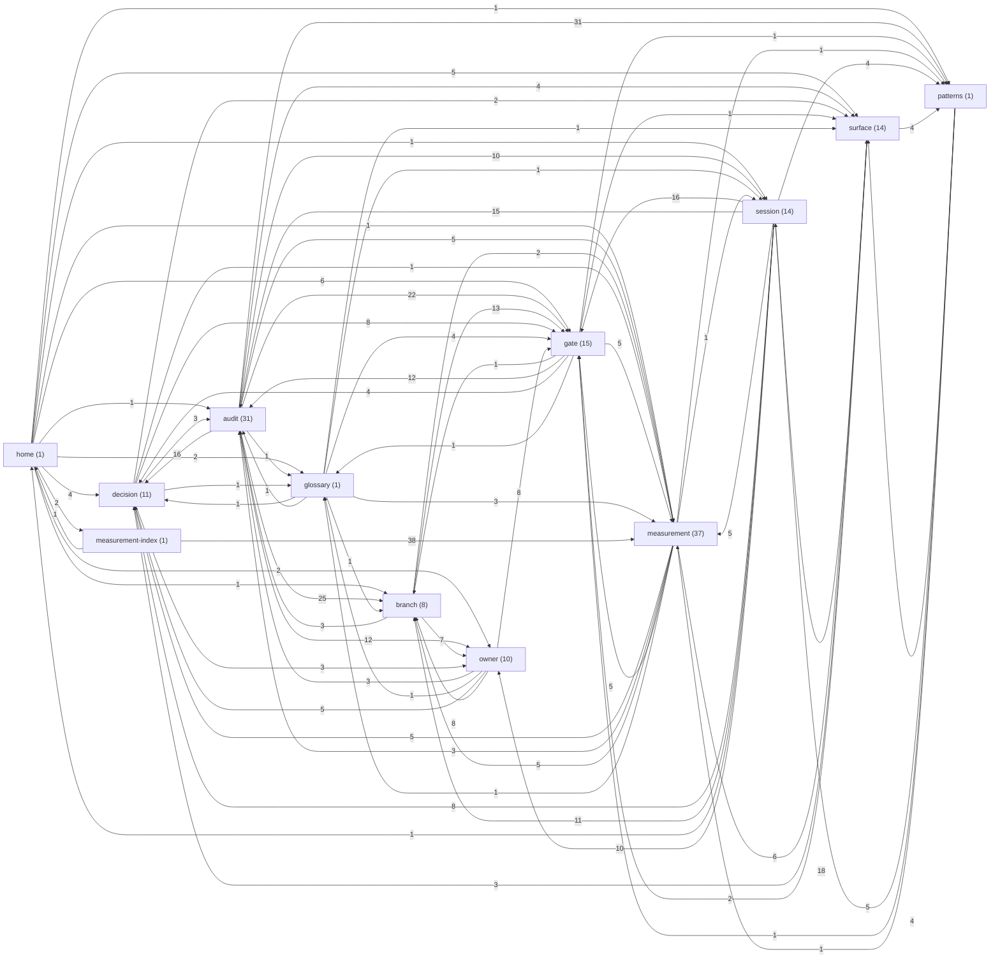

# Project Brain — Graph

_Generated by `npm run brain` (scripts/brain-graph.mjs). Do not edit by hand — a manual edit is overwritten on the next regeneration._

144 notes, 613 resolved links.

## Type-level structure

## Top 20 most-linked notes

| Rank | Note | Type | Degree (in+out) |
|---:|---|---|---:|
| 1 | [[Patterns]] | patterns | 53 |
| 2 | [[Measurements Index]] | measurement-index | 41 |
| 3 | [[Owner - R5 Measurement and Merge]] | owner | 37 |
| 4 | [[Surface - Script Doctor Panel]] | surface | 34 |
| 5 | [[Gate - Receipt Gate]] | gate | 32 |
| 6 | [[00 Home]] | home | 28 |
| 7 | [[Gate - AUC-24 Ratchet]] | gate | 28 |
| 8 | [[Surface - Coverage HTML]] | surface | 28 |
| 9 | [[Surface - Coverage Letter]] | surface | 24 |
| 10 | [[Branch - R5 Verbosity Bias]] | branch | 23 |
| 11 | [[Audit - 2026-09-20 Parked Branches]] | audit | 22 |
| 12 | [[Gate - Public Benchmark]] | gate | 21 |
| 13 | [[Glossary]] | glossary | 19 |
| 14 | [[Audit - 2026-09-13 CI Green]] | audit | 18 |
| 15 | [[Branch - Feature-Length Defects]] | branch | 17 |
| 16 | [[Audit - 2026-09-12 Adversarial Review]] | audit | 16 |
| 17 | [[Audit - 2026-09-18 CI Docs Fast Path]] | audit | 15 |
| 18 | [[Measurement - DISCRIMINATION_BASELINE_2026-07-29]] | measurement | 15 |
| 19 | [[Session - 2026-09-06 Current Synced Upgraded]] | session | 15 |
| 20 | [[Decision 3 - Demote Generative Surface to Labs]] | decision | 14 |
