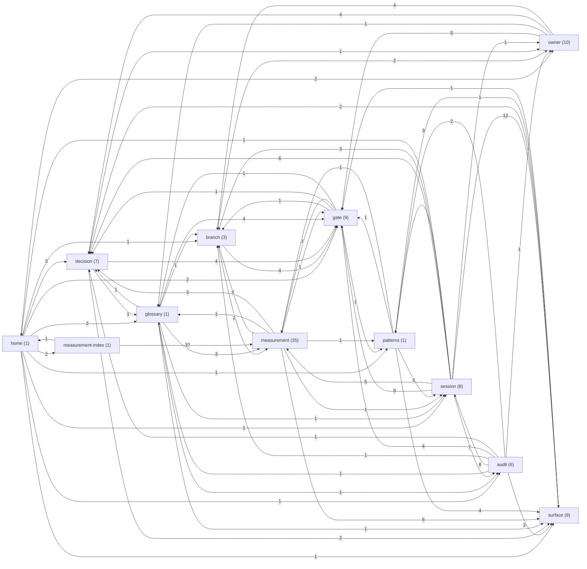

# Project Brain — Graph

_Generated by `npm run brain` (scripts/brain-graph.mjs). Do not edit by hand — a manual edit is overwritten on the next regeneration._

91 notes, 268 resolved links.

## Type-level structure

## Top 20 most-linked notes

| Rank | Note | Type | Degree (in+out) |
|---:|---|---|---:|
| 1 | [[Measurements Index]] | measurement-index | 40 |
| 2 | [[Patterns]] | patterns | 20 |
| 3 | [[Glossary]] | glossary | 19 |
| 4 | [[00 Home]] | home | 18 |
| 5 | [[Branch - R5 Verbosity Bias]] | branch | 18 |
| 6 | [[Surface - Script Doctor Panel]] | surface | 18 |
| 7 | [[Gate - Receipt Gate]] | gate | 16 |
| 8 | [[Gate - AUC-24 Ratchet]] | gate | 14 |
| 9 | [[Measurement - DISCRIMINATION_BASELINE_2026-07-29]] | measurement | 12 |
| 10 | [[Session - 2026-09-03 Retrospective Findings]] | session | 12 |
| 11 | [[Session - 2026-09-04 Evening Build Attack Repair]] | session | 12 |
| 12 | [[Session - 2026-09-05 Review Batch]] | session | 12 |
| 13 | [[Owner - Index]] | owner | 11 |
| 14 | [[Owner - R5 Measurement and Merge]] | owner | 11 |
| 15 | [[Session - 2026-09-05 Mistake Search and Brain]] | session | 11 |
| 16 | [[Audit - 2026-09-06 Mistake Search]] | audit | 10 |
| 17 | [[Measurement - STRUCTURAL_SIGNALS_2026-09-04]] | measurement | 10 |
| 18 | [[Branch - Advice Rule Fixes]] | branch | 9 |
| 19 | [[Branch - Stacked R5 plus Advice]] | branch | 9 |
| 20 | [[Surface - Coverage Letter]] | surface | 9 |
