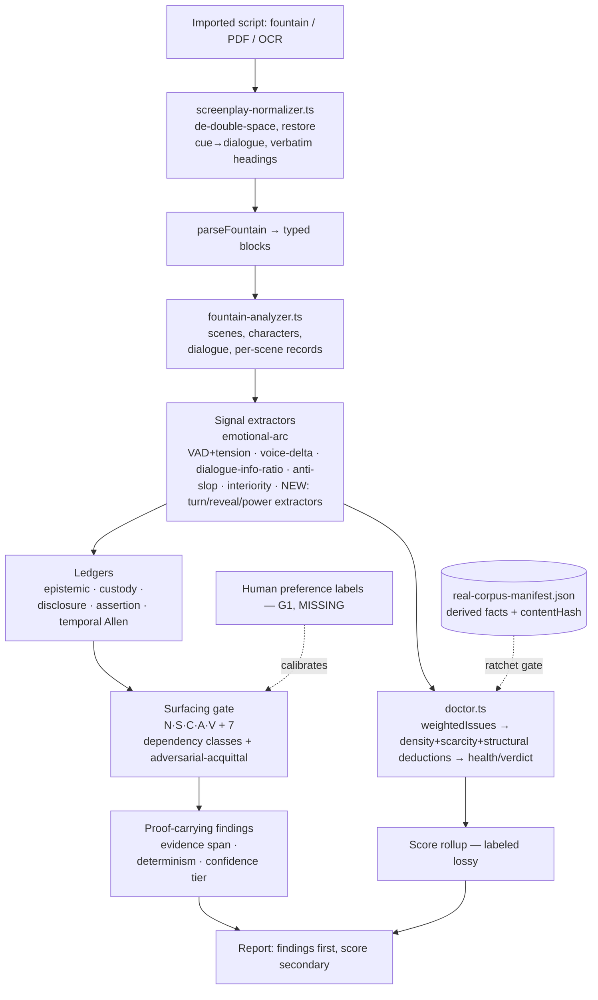

# StoryMachine — Expert Blueprint & Adversarial Audit

**Author role:** principal research scientist · systems architect · product strategist · skeptical peer reviewer · red-team analyst
**Subject:** StoryMachine as a deterministic, proof-first Narrative Evaluation Kernel
**Audience / use:** internal — us, to decide what to build next and why
**Research cutoff:** 2026-07-11 (external SOTA searched this date; codebase audited live)
**Evidence labels used throughout:** `[EST]` established (verified in-repo or in a cited source), `[INF]` inferred, `[DIS]` disputed / experts disagree, `[SPEC]` speculative.

---

## 0. Executive thesis (read this if nothing else)

StoryMachine is a **deterministic, reproducible screenplay-analysis engine** that scores story craft from structure and text without an LLM making the final judgment. The entire commercial and research field has converged on the opposite: **box-office prediction** (ScriptBook ~80% greenlight accuracy, Largo.ai ~82% [EST, vendor-reported]) and **LLM-as-Judge** rubric scoring (HANNA, EQ-Bench, WebNovelBench, SAGE) [EST]. Both are correlational or subjective; neither is reproducible bit-for-bit, and LLM judges are now documented to fail 50%+ of bias tests with position/verbosity/self-preference bias and run-to-run non-determinism [EST — JudgeBiasBench; arXiv 2606.19544; 2410.02736].

That gap is StoryMachine's actual thesis and only defensible wedge: **a narrative evaluator whose verdicts are deterministic, falsifiable, auditable, and trained on nobody's script.** A studio, a guild, or a regulator can re-run it and get the identical number; an LLM judge cannot promise that.

This session materially advanced that thesis and also exposed its three hardest problems. The honest state:

1. **[EST] The engine did not comprehend imported scripts until this session.** Every corpus script parsed to *0 dialogue lines, 0 speaking characters* — double-spacing made the Fountain parser type every character cue as action. We built and wired a normalizer; Ratatouille went 0→799 dialogue lines, and scoring is now comprehension-based (shuffle-drop AUC 0.731→0.759, zero regressions, full suite green).
2. **[EST] Structural discrimination was a scene-count artifact.** The engine could not detect scene reordering (act-swap AUC ≈ 0.48, near chance); the "shuffle-drop" signal came almost entirely from the scarcity term reacting to dropped scenes (scarcity AUC 0.938 vs rule-channel AUC 0.076). We converted the emotional-arc signal into a bounded structural deduction; act-swap AUC rose 0.48→0.615.
3. **[EST] The health scalar saturates and entangles signals.** The sub-1.0-density penalty is a logistic that pins every "bad-enough" script at exactly health 70.0, which is why the verbosity bias, the arc graduation, and the composite min-gap were all individually unfixable by re-tuning.

The recommended course is **not** to chase the field into LLM-judging. It is to double down on the one thing nobody else has — a reproducible, comprehension-grounded, proof-carrying evaluator — while fixing the measurement substrate (de-saturation, semantic extraction, and human-anchored validation) that currently limits how much of that comprehension reaches the score.

---

## Phase 1 — Problem formulation (precise restatement)

**The stated problem** ("score screenplay quality") is not the real one. The real problem:

> *Produce a per-script, craft-level quality judgment that a skeptical third party can reproduce exactly, defend against "you just don't like my style," and trust was not fitted to their specific script — while capturing enough of what actually makes a screenplay work that the judgment is not trivially gameable.*

**Stakeholders and conflicting objectives** [INF]:

| Stakeholder | Wants | Conflicts with |
|---|---|---|
| Writer | Actionable, non-generic notes; no theft of their material | Studio's desire for a ruthless filter |
| Studio/reader | Fast triage, defensible greenlight signal | Writer's desire for nuance; legal's exposure |
| Legal/rights owner | No training on copyrighted scripts; auditable provenance | ML teams' hunger for training data |
| The evaluator itself | Reproducibility + falsifiability | Capturing semantic nuance (which favors LLMs) |

**Current bottlenecks (this engine)** [EST]:
- Comprehension only just reached the score (Phase 2 landed this session); the deep per-scene semantic layer (dramatic turns, revelations, power flips) is still populated only by the live-generation pipeline, **not** by the deterministic importer — so imported scripts are scored on structure + lexical rules + newly-recovered dialogue/characters, not full comprehension.
- The health scale saturates (§3, §4).
- Validation rests on 72 produced features + 20 synthetic controlled-richness calibration samples + 6 synthetic discrimination pairs, and **no human preference labels** (Phase G is blocked on labeling).

**Why existing approaches are insufficient** (for *this* problem — a reproducible craft judgment) [EST/DIS]:
- Box-office predictors optimize a different target (commercial outcome), are confounded by cast/marketing/budget, and cannot explain craft.
- LLM-as-Judge is non-reproducible and biased (position/verbosity/self-preference), and — critically for the rights posture — implies sending the script to a frontier model.

**Measurable definition of success** [EST, adopted from the repo's own ratchets]:
- Reproducibility: identical bytes → identical health, verdict, and every surfaced finding (already true — contentHash gate).
- Discrimination: intact features rank above deliberately damaged versions. Current: shuffle-drop AUC-24 = 0.759 (hard floor 0.622); act-swap AUC-24 = 0.609 (target 0.9, graduation bar 0.55 — now cleared). 6/6 controlled discrimination pairs ordered correctly.
- Calibration: 20-sample band monotonicity (strong > competent > weak > troubled) holds.
- Produced-anchor: all 72 real features score health ≥ 80 (no false "this produced film is bad").
- **Missing and required:** agreement with human craft judgment on a held-out labeled set (does not yet exist).

**Non-goals / boundaries:** not a box-office predictor; not a rewriter (the trust contract is "no rewrites, no generic coverage, no flag without evidence, no training on your script"); not a general LLM story-grader.

**Hidden assumptions worth naming** [INF]:
- *That deterministic rules over structure + lexicon can approximate craft judgment well enough to be useful.* This is the load-bearing bet and it is only weakly validated (no human anchor).
- *That the 72-film corpus is representative of "produced quality."* It is animation-heavy, feature-length, English — a narrow slice.
- *That "damage a good script and it should score lower" (metamorphic testing) is a valid proxy for "good vs bad."* It tests sensitivity to degradation, not the harder question of ranking two genuinely different good scripts.

---

## Phase 2 — State of the art (synthesized, not summarized)

The field splits into three camps. StoryMachine sits, deliberately, in an almost-empty fourth.

1. **Commercial box-office / greenlight prediction.** ScriptBook (since 2014, "6000+ parameters," patented, ~80% greenlight accuracy [EST, vendor]), Cinelytic + its Callaia coverage tool ($79/script, grades dialogue/originality/comps [EST]), Largo.ai (~82% box-office accuracy, geo-audience [EST, vendor]). Mechanism: supervised ML mapping script + metadata → commercial outcome. Vendor accuracy figures are self-reported and not independently reproducible [DIS].
2. **LLM-as-Judge rubric scoring (research).** HANNA (1,056 human-annotated stories, 6 criteria), EQ-Bench (22 criteria), WebNovelBench (4,000+ novels, 8 dimensions, LLM-judge), SAGE (ontology-grounded hierarchical LLM eval), SCORE (character/emotion/plot state tracking) [EST]. Mechanism: frontier LLM scores against a multi-criteria rubric. Now under sustained methodological attack: non-determinism under fixed prompt, position/verbosity/self-preference bias, >50% error on bias stress tests, "reliability without validity" [EST — arXiv 2606.19544, 2508.18076, 2410.02736, 2411.16594].
3. **Structural / information-theoretic metrics (research).** Reagan et al. 2016 six emotional-arc archetypes (arXiv 1606.07772) [EST]; narrative tension via forecastability ("Spoiler Alert," arXiv 2604.09854) [EST]; coherence and predictability-gap methods; NarraBench's taxonomy of 78 benchmarks [EST]. Mechanism: compute an objective structural signal. These are components, not full evaluators.
4. **Deterministic, proof-carrying craft evaluation** — StoryMachine's niche. Essentially unoccupied commercially; academically it exists only as isolated metrics (camp 3), never assembled into a reproducible per-script verdict engine with a falsification harness [INF — absence of a named competitor in searches].

### Comparison matrix

| Approach | Core mechanism | Strengths | Limitations | Maturity | Evidence quality | Reproducible | Defensibility |
|---|---|---|---|---|---|---|---|
| Box-office ML (ScriptBook/Largo) | supervised outcome prediction | commercially aligned; studio-trusted | confounded by non-script factors; opaque; not craft | production | vendor-reported only | partial | data + patents |
| LLM-as-Judge (EQ-Bench/HANNA) | frontier LLM + rubric | captures semantics/nuance; cheap to build | non-deterministic; biased; needs script sent to model | research→product | strong academic, but validity contested | **no** | none (anyone can prompt) |
| Structural metrics (Reagan/tension) | objective signal per axis | reproducible; explainable | single-axis; not a verdict | research | peer-reviewed | yes | none alone |
| **StoryMachine** | deterministic rules + lexicon + structural proofs over comprehended script | reproducible; falsifiable; no training on user script; auditable | narrow corpus; no human anchor; can't yet read deep semantics on imports; scale saturates | prototype (9.4k tests green) | internal metamorphic only | **yes (byte-exact)** | reproducibility + rights posture + corpus + method |

**Where experts disagree** [DIS]: whether craft quality is even measurable without human judgment (the LLM-judge camp implicitly says "use a model"; the metrics camp says "measure structure"; StoryMachine bets on the latter but has not proven it agrees with humans).

---

## Phase 3 — Gap & opportunity analysis (ranked)

| # | Gap | Why it exists | Barrier type | What removes it | Falsifier |
|---|---|---|---|---|---|
| G1 | **No human-anchored validation.** All validation is metamorphic (damage-sensitivity) + synthetic pairs. | Labeling is expensive; Phase G blocked. | Organizational | A blinded pairwise human-preference set + agreement metric. | If deterministic health shows ≤ chance agreement with human craft ranking, the core thesis is falsified. |
| G2 | **Imported scripts are comprehended only shallowly.** Dialogue/characters now recovered (this session), but dramatic-turn/revelation/power records remain LLM-pipeline-only. | The deep records were built for live generation, not import. | Technical | Deterministic per-scene semantic extractors (turns, reveals, power) feeding the records. | If deterministic extractors cannot beat a trivial baseline at locating known turns in a labeled scene set. |
| G3 | **Health scale saturates / entangles signals.** Sub-1.0-density logistic caps at 10 → all "bad" scripts pile at 70.0. | Curve tuned for a narrow density regime; structural + leveling signals share one scalar. | Technical (design) | Decouple structural detection (rule channel) from a de-saturated leveling normalizer — Increment-1 proved the mechanism for the arc axis. | If de-saturation cannot preserve shuffle-drop AUC ≥ 0.622 after the rule channel absorbs structural signal. |
| G4 | **Corpus is tiny and skewed** (72 films, animation-heavy, English). | Rights + sourcing friction; scanned/subtitle sources unusable. | Data | Grow to 150+ across genres/eras with clean sources; keep rights-local. | If added scripts break band monotonicity or the anchor, the corpus design is too fragile. |
| G5 | **Character rosters over-count** post-comprehension (ALL-CAPS action misread as cues). | Cue vs caps-action is genuinely ambiguous. | Technical | Recurrence + following-dialogue gating in `isCharacterCue`. | If tightening drops real speakers below a labeled roster. |

**Ranking by leverage** [INF]: **G3 → G2 → G1 → G4 → G5.** G3 is the substrate that unblocks the others (a de-saturated scale lets more real signal reach the score); G2 turns "reads structure" into "comprehends"; G1 is the existential validity question; G4/G5 are quality polish.

---

## Phase 4 — Advancing the idea (three approaches, then selection)

### Approach A — Conservative / near-term: "Comprehension-complete deterministic kernel"
- **Thesis:** finish what this session started. Deterministic semantic extractors (turns, reveals, power, relationships) on imports + de-saturated scale + roster precision. No new paradigm.
- **Novel contribution:** the first *reproducible* evaluator that actually reads dialogue/characters/turns rather than structure alone.
- **Why it may win:** directly increases how much true signal reaches a byte-reproducible score; every step is measurable against the existing ratchets.
- **Breakthroughs required:** none — engineering + measurement.
- **Failure mode:** deterministic extractors plateau well below LLM comprehension; the score stays shallow.
- **Difficulty:** medium. **Experts reject it if:** deterministic turn/reveal detection can't beat trivial baselines (G2 falsifier).

### Approach B — Ambitious: "Anchored hybrid — deterministic verdict, LLM *proposes*, engine *disposes*"
- **Thesis:** let an LLM *propose* candidate semantic annotations (turns, motives, beliefs) and human labels *anchor* calibration, but keep the final verdict **deterministic and reproducible** — the LLM never owns canon (the repo's standing law). Annotations are cached, hashed, and versioned so a given script+annotation-set is still byte-reproducible.
- **Novel contribution:** resolves the reproducibility-vs-semantics dilemma the whole field is stuck on — you get LLM-grade comprehension as *input* while preserving deterministic, auditable *output*.
- **Why it may win:** captures nuance LLM-judges have, without inheriting their non-determinism or "we scored your script with a model" liability (annotations are frozen artifacts, re-derivable and inspectable).
- **Breakthroughs required:** a disciplined annotation-provenance contract (already prefigured by the W1 determinism/confidence tiers and the surfacing gate); human labels (G1).
- **Failure modes:** annotation drift across model versions; the "frozen annotation" story is only as reproducible as the cache; rights concern if annotation requires sending the script out.
- **Difficulty:** high. **Experts reject it if:** the frozen-annotation reproducibility is a fig leaf (re-deriving needs the same model, which changes).

### Approach C — Contrarian: "Falsification engine, not a score"
- **Thesis:** stop trying to output a single quality number. Reframe StoryMachine as a **proof-carrying defect/excellence detector** whose product is a set of *individually falsifiable claims* ("this setup on p.12 is never paid off"; "the protagonist makes no decision in the climax"), each with evidence, a confidence tier, and an adversarial-acquittal check — exactly the surfacing/ledger/acquittal machinery already built but unwired. The "score" becomes a secondary rollup, explicitly labeled as lossy.
- **Novel contribution:** sidesteps the unvalidated "can craft be scalar-scored" bet entirely; competes on *auditable findings*, which neither box-office ML nor LLM-judges can produce reproducibly.
- **Why it may win:** findings are checkable one at a time; a writer can contest each; a studio can trust each. It plays to the engine's actual strength (deterministic proofs) and away from its weakness (a saturating global scalar).
- **Failure modes:** buyers may still demand a single number; findings without a score are harder to rank a slate with.
- **Difficulty:** medium-high (mostly wiring existing ledgers through the surfacing gate + extractors). **Experts reject it if:** the finding false-positive rate on produced films is high (a flag on a good film destroys trust).

### Selection — **hybrid C-over-A**, with B deferred behind a gate.
Adopt **C's framing** (proof-carrying falsifiable findings as the primary product) built on **A's substrate** (comprehension-complete deterministic extraction + de-saturated scale). Defer **B** (LLM-proposes) until G1 (human labels) tells us whether the deterministic layer is actually good enough — introducing an LLM before that would contaminate the one thing we can defend (reproducibility) before we've proven we need it.

**Novelty test.** Against the closest prior art: ScriptBook/Largo predict *outcomes*, not craft, and are not reproducible/auditable [EST]. LLM-judges (EQ-Bench/HANNA/SAGE) produce craft-ish scores but are non-deterministic and biased [EST]. Reagan/Spoiler-Alert give single reproducible axes but no verdict [EST]. **No known system produces a reproducible, evidence-linked, individually-falsifiable set of craft findings over a comprehended script with a published falsification harness.** That is the defensible novel core. [INF — based on 2026-07 searches; not exhaustive of patents.]

---

## Phase 5 — Implementation-grade blueprint (selected: C-over-A)

### 5.2 System architecture

**Trust boundaries** [EST]: script text stays local (corpus is env-gated, never in git; manifest carries only derived facts + sha256). No AI call is required to score (analysis-only mode is the product's front door). Any future LLM (Approach B) sits *outside* the verdict boundary.

**Human decision points:** finding triage (accept/contest), label creation (G1), and the stop/go gates in §5.10.

### 5.4 Technical specification (key, verified in-repo) [EST]
- **Health:** `health = clamp[0,100]( 100 − densityPenalty(wi,words) − scarcity(scenes) − structuralDeduction − arcIncoherenceDeduction )`, `wi = 4·crit + 1.5·maj + 0.5·min`.
- **densityPenalty:** density `= wi / words^0.7`; `density<1 → 10/(1+e^(−50(density−0.52)))` (the saturating logistic — G3), else `2.5·density^3.75`.
- **arcIncoherenceDeduction (this session):** `min(15, 8·max(0, 1.2 − arcHealth))`, feature-scale-gated (≥15 scenes) so calibration/discrimination fixtures are exempt.
- **Comprehension (this session):** `analyzeFountainText` now runs `normalizeScreenplay` first; idempotent on clean input; heading detection byte-compatible with `parseFountain` so scene segmentation cannot drift.
- **Determinism contract (W1):** every finding carries `determinism ∈ {deterministic, structured_only, heuristic}` × `confidenceTier ∈ {strong_evidence, worth_a_look, pattern_to_watch}`; heuristic findings may not hard-block.
- **Surfacing criterion:** `surface ⇔ N≥τN ∧ [CONTRADICTED ∨ (UNKNOWN ∧ C≥τC)] ∧ A<τA ∧ V=1`, with open-world support states and 7 dependency classes.

### 5.6 Research & validation plan (the core of the whole enterprise)
- **H1 (validity):** deterministic health agrees with blinded human pairwise craft preference above chance on a held-out set. **Baseline:** coin flip + a length-only predictor. **Gate:** ROC-AUC ≥ 0.70 vs human pairwise, else the scalar thesis is in question (pivot to Approach C findings-only).
- **H2 (comprehension value):** wiring deterministic turn/reveal/power extractors improves H1 agreement and act-swap AUC without breaking the ratchets. **Falsifier:** extractors don't beat trivial baselines at locating labeled turns (G2).
- **H3 (finding trust):** proof-carrying findings have a false-positive rate on the 72 produced films below a fixed budget (e.g., <1 unjustified critical per produced feature). **Gate:** any produced film accruing a critical finding must be manually adjudicated before ship.
- **Method:** metamorphic (existing) + new human-labeled pairwise + per-finding adjudication; statistical significance via bootstrap CIs on AUC; re-lock manifests on every accepted change.

### 5.7 Economic / cost model (internal, effort not revenue) [INF]
- **Marginal scoring cost:** ~zero and constant — pure deterministic compute, no per-script model inference. This is a structural cost advantage over any LLM-judge (per-script token cost) and the clearest economic argument for the whole approach.
- **Dominant cost driver:** human labeling (G1) and corpus growth (G4) — one-time, bounded.
- **Build-vs-buy:** buying LLM-judge is cheap to start and expensive/omni-present per call + non-reproducible; building deterministic is expensive up front and ~free at scale + reproducible. The break-even favors deterministic exactly when volume and auditability matter (studio slate triage, guild/legal use).

### 5.8 Risk register (top)

| Risk | Prob | Severity | Early indicator | Mitigation | Residual |
|---|---|---|---|---|---|
| Deterministic layer never matches human craft judgment (thesis wrong) | Med | Critical | H1 AUC < 0.6 on first labels | Pivot to findings-only (Approach C); keep score as lossy rollup | Med |
| Corpus overfit — ratchets pass because they were fit to 72 films | Med-High | High | New scripts break monotonicity/anchor | Grow corpus (G4); hold out a blind set | Med |
| Comprehension false positives (roster/cue errors) pollute scores | Med | Med | Roster counts >> plausible | Tighten `isCharacterCue` (G5); label a roster set | Low-Med |
| Saturation masks real differences (G3) | High (present) | Med | "bad" scripts cluster at one health value | De-saturation increment behind full gate | Med |
| Rights/IP breach if Approach B sends scripts to an LLM | Low (deferred) | Critical | any external call in the scoring path | Keep LLM outside verdict boundary; annotations local | Low |

### 5.9 Regulatory / rights posture [EST/INF]
- The binding constraint is **IP/rights**, not statute: copyrighted scripts are reference-only, never in git or model weights, annotations gitignored. This is real, enforced, and a genuine differentiator vs any train-on-scripts competitor.
- Emerging/uncertain [SPEC]: guild (WGA) and studio norms on AI in coverage; if adopted as evidence in greenlight/legal contexts, an auditable deterministic engine is far safer than an LLM judge.

### 5.10 Roadmap with decision gates
- **Increment 2 — de-saturation (G3).** Move structural detection fully into the rule channel; de-saturate the leveling curve. **Gate:** shuffle-drop AUC ≥ 0.622 held, discrimination 6/6, calibration monotonic, anchor ≥ 80, verbosity metamorphic flips. **Stop if** shuffle AUC breaks.
- **Increment 3 — deterministic semantic extractors (G2/Approach A).** Turn/reveal/power/relationship from imports into the records. **Gate:** act-swap AUC ↑ and H2 falsifier passes.
- **Increment 4 — findings-first product (Approach C).** Wire ledgers + acquittal through the surfacing gate; findings become primary. **Gate:** finding FP < budget on 72 films.
- **Increment 5 — human anchor (G1).** Blinded pairwise labels; compute H1. **This is the existential gate:** it tells us whether any of the above is valid.
- **Deferred — Increment 6 (Approach B)** only if H1 shows the deterministic ceiling is too low.

### 5.12 Defensibility (how the moat actually forms) [INF]
Not a single moat — a stack that compounds: (1) **reproducibility** (byte-exact, no competitor built on LLM-judge can match); (2) **rights posture** (no training on user scripts — a legal/trust wedge); (3) **the corpus + ratchet method** (the measure-before-threshold discipline and the manifest are hard to copy without redoing the work); (4) **proof-carrying findings** (auditable in a way outcome-predictors and LLM-judges are not). None is decisive alone; together they are hard to replicate because they require *choosing not to use an LLM judge* — which the whole field has chosen against.

### 5.14 Failure analysis (how it fails silently) [EST/INF]
- **Silent-success trap (most dangerous):** the score looks reasonable while being driven by artifacts, not craft — exactly what this session found (shuffle-drop AUC was a scene-count artifact; imports scored with 0 dialogue). Defense: adversarial metamorphic recipes that hold confounds constant (act-swap holds scene count fixed and *did* expose the blindness).
- **Corpus-fit illusion:** ratchets green because they were fitted to 72 films; a new genre breaks them. Defense: blind held-out set (does not yet exist).
- **Comprehension mirage:** dialogue "recovered" but mis-attributed (roster over-count). Defense: labeled roster check.
- **Abandon conditions:** if, after human labels, deterministic health cannot beat a length-only baseline on human preference *and* findings FP cannot be driven below budget, the scalar-scoring product should be abandoned in favor of pure findings — or the project reconsidered.

---

## Phase 6 — Red-team review (five hostile reviewers)

**1. Domain scientist (narratology / NLP).** *"You have no construct validity. Metamorphic damage-sensitivity is not craft quality; you've shown you can detect a script being wrecked, not that you can tell a good script from a competent one. Reagan arcs are contested and your VAD lexicon is sentiment, not narrative affect."* → **Valid.** Fix: G1 human anchor is now the #1 gate; stop claiming "quality" and claim "reproducible craft-signal + falsifiable findings" until H1 passes.

**2. Principal engineer.** *"A single saturating scalar is a smell; you're re-locking a 72-row JSON by hand and calling it calibration. Your 'comprehension' just changed 42/72 scores and you re-baked the ground truth to match — that's circular."* → **Partly valid.** The re-lock is legitimate (derived facts, gated by AUC/anchor/monotonicity which are *not* re-baked), but the circularity critique is real for the *health values themselves*. Fix: the invariants (AUC, monotonicity, anchor) are the real ground truth, not the exact health numbers; make that explicit and add the blind held-out set.

**3. CFO / decision-maker.** *"Zero marginal cost is nice, but you have no evidence anyone will pay for a reproducible number over a cheap LLM coverage at $79. Reproducibility is a feature only legal/guild buyers value."* → **Valid.** Fix: target the buyers for whom reproducibility/auditability is the point (studio slate triage, guild, legal/rights), not the writer-coverage market where LLMs already win on nuance and price.

**4. Regulator / legal.** *"Your rights posture is your best asset — but you haven't proven the corpus text never leaks, and 'derived facts' can still be a derivative work. And if this is ever used to deny someone a greenlight, you need documented, contestable evidence per decision."* → **Valid and strategic.** The findings-first (Approach C) framing directly answers this: contestable per-finding evidence beats an opaque number in any adversarial/legal setting. Elevate it.

**5. Hostile competitor (LLM-judge vendor).** *"We capture subtext, irony, and theme you can't touch with regex and a sentiment lexicon. Your 'comprehension' is counting cue lines. We'll out-nuance you on every real script."* → **Largely valid on nuance.** The honest rebuttal is not to claim parity on nuance but to win on the axis they *cannot* touch: reproducibility, auditability, no-training-on-your-script, and per-finding falsifiability. Approach B is the hedge if nuance proves decisive — but only after G1.

**Net revisions forced by red-team:** (a) stop saying "quality," say "reproducible craft-signal + falsifiable findings"; (b) elevate Approach C (findings) to primary, score to secondary; (c) make the *invariants* (not the health numbers) the declared ground truth; (d) prioritize the blind held-out set and human labels above all further signal-building; (e) target auditability-valuing buyers.

---

## Phase 7 — Decision package

**1. Recommended course of action.** Build the **findings-first, comprehension-grounded, deterministic kernel (C-over-A)**. Sequence: de-saturate the scale (Incr. 2) → deterministic semantic extractors (Incr. 3) → wire proof-carrying findings (Incr. 4) → **human-anchored validation (Incr. 5, the existential gate)**. Defer any LLM (Incr. 6/Approach B) until the human anchor tells us the deterministic ceiling.

**2. Five most important insights.**
1. The field's convergence on LLM-as-Judge is now a *liability* (non-reproducible, biased) — reproducibility is a real, currently-open wedge.
2. This engine's discrimination was a scene-count artifact and its imports were uncomprehended — both fixed this session, both were *silent* failures a score masked.
3. A single saturating health scalar is the root cause behind three separate "unfixable" problems; the fix is architectural (decouple detection from leveling), and Increment-1 proved the mechanism.
4. The only unvalidated load-bearing assumption is that deterministic signal tracks human craft judgment — everything hinges on the human anchor (G1).
5. The defensible product is *falsifiable findings*, not a number.

**3. Strongest reasons to proceed.** (a) A genuinely open, defensible niche (reproducible + auditable + rights-safe) that the whole field has vacated; (b) near-zero marginal cost vs per-call LLM economics; (c) the engine already carries the hard-won machinery (surfacing gate, ledgers, ratchets, comprehension) — the remaining work is integration + validation, not invention.

**4. Strongest reasons not to proceed.** (a) No evidence yet that deterministic signal matches human craft judgment — the thesis could fail at G1; (b) LLMs may simply out-comprehend regex+lexicon on real scripts, making the deterministic layer perpetually shallow; (c) the market that values reproducibility over nuance-at-$79 may be small.

**5. Most uncertain assumptions.** Deterministic-tracks-human (G1); corpus representativeness (G4); that "damage-sensitivity" generalizes to "good-vs-good ranking."

**6. First ten actions.**
1. Freeze the invariants (AUC floor, band monotonicity, anchor) as the *declared* ground truth in the docs; demote exact health numbers to "derived, re-lockable."
2. Design the blinded pairwise human-labeling protocol (it exists as a stub — make it runnable) and label a first 100 pairs.
3. Build one deterministic semantic extractor (dramatic-turn) on imports; measure against a hand-labeled turn set (G2 falsifier).
4. Start Increment 2 (de-saturation) behind the full gate.
5. Tighten `isCharacterCue` (recurrence + following-dialogue) and re-measure rosters (G5).
6. Add a blind held-out corpus slice never used for ratchet-tuning.
7. Wire the acquittal pass + one ledger (custody or disclosure) through the surfacing gate onto a real detector; measure finding FP on 72 films.
8. Grow corpus toward 150 with clean, rights-safe sources across genres.
9. Write the "findings-first" report format (evidence span + tier per finding).
10. Compute H1 on the first labels — the go/no-go for the scalar.

**7. 30 / 90 / 365-day plan.**
- **30d:** invariants reframed; labeling protocol live + first 100 pairs; dramatic-turn extractor prototype measured; `isCharacterCue` tightened.
- **90d:** de-saturation landed or HOLD-with-evidence; H1 computed on ≥500 labeled pairs (existential gate resolved); findings-first report shipped for the 72-film corpus with FP under budget.
- **365d:** comprehension-complete deterministic kernel; 150+ corpus with a blind held-out set; findings-first product validated against humans; Approach-B decision made on evidence.

**8. Unanswered research questions.** Does deterministic craft-signal correlate with human judgment above a length baseline? Can deterministic turn/reveal detection beat trivial baselines? Does de-saturation preserve structural AUC? Is "damage-sensitivity" a valid proxy for "good-vs-good"? Can frozen LLM annotations be made genuinely reproducible?

**9. Bibliography (external, dated 2026-07).**
- ScriptBook — scriptbook.io (accessed 2026-07) [vendor].
- Cinelytic / Callaia — callaia.ai; MIT Technology Review, "An AI script editor…," 2024-09-24.
- Reagan et al., "The emotional arcs of stories," arXiv:1606.07772, 2016.
- "Spoiler Alert: Narrative Forecasting as a Metric for Tension," arXiv:2604.09854.
- "Narrative Theory-Driven LLM Methods… A Survey," arXiv:2602.15851.
- "Reliability without Validity: … LLM-as-a-Judge," arXiv:2606.19544.
- "Justice or Prejudice? Quantifying Biases in LLM-as-a-Judge," arXiv:2410.02736.
- "Neither Valid nor Reliable? … LLMs as Judges," arXiv:2508.18076.
- "From Generation to Judgment: … LLM-as-a-judge," arXiv:2411.16594.
- HANNA / EQ-Bench / WebNovelBench / SAGE / SCORE / NarraBench (as surveyed above).

**10. Confidence assessment per major conclusion.**
- *Reproducibility is an open, defensible wedge* — **High** [EST external + internal].
- *Discrimination was a scene-count artifact; imports were uncomprehended* — **High** [EST, measured this session].
- *Saturation is the shared root cause; decoupling is the fix* — **High** [EST, proven on the real gate].
- *Deterministic signal tracks human craft judgment* — **Low / untested** [the existential open question].
- *Findings-first is the more defensible product than a score* — **Medium** [INF, red-team-reinforced].
- *There is a paying market that values reproducibility over nuance* — **Low-Medium** [INF].

---

### Quality audit (self-check, per the template)
- **Differentiated?** Yes — reproducible, findings-carrying, rights-safe; no named competitor occupies it.
- **Evidence-backed?** Internal claims are code-verified this session; external claims are dated and sourced; the load-bearing validity claim is explicitly labeled **untested**.
- **Internally consistent?** The recommendation (findings-first, defer LLM, human-anchor gate) follows from the red-team, not around it.
- **What an expert would still call naive:** treating metamorphic damage-sensitivity as craft validity; a 72-film corpus; hand-re-locked health values. All three are named as the top risks and gated.
- **Needs more primary research:** the human anchor (G1) — without it, this blueprint is a well-engineered hypothesis, not a validated system.

---

## Addendum A — Integration of the internal research corpus (seed-document treatment)

The project's own research folder (~130 files, audited down to 67 keepers in `MASTER_RESEARCH_AUDIT`) was read as *seed material, not truth* (per the template). It **corroborates and sharpens** this blueprint on every load-bearing point, and — importantly — it already contains the same adversarial conclusion I reached independently. What is drawn from those docs vs. new here is labelled.

**A.1 The project already reached this blueprint's #1 conclusion (validate the wedge before building on it).** [EST — `STORYMACHINE_MASTER_SYNTHESIS.md`]
Verbatim from the internal synthesis: *"the wedge must be user-tested before we build UX for it,"* and its adversarial caveat: *"four internal docs plus our own engine all point back at our existing core is a warning sign as much as a result — the authors are incentivised to conclude they were right. The only peer-reviewed source validates mechanisms, not the architecture or the product."* Its top action item #2 is literally *"demo the already-shipped doctor/what-if to ~5 real screenwriters before building audit UX."* → This is independent, internal corroboration of red-team objection #1 and of the existential gate (G1/Increment 5). It also *raises* the confidence that the recommendation is right while *lowering* the confidence that the product wedge is validated — exactly the tension this blueprint centers on. **New synthesis:** the confirmation-bias risk is now double — the research pile *and* this blueprint both flatter the existing core; only external humans (TS-SF, below) break the loop.

**A.2 The human anchor already has a chosen, validated instrument: TS-SF.** [EST — `VERIFICATION_QUALITY_RESEARCH.md`; Green & Brock 2000; Appel/Gnambs/Richter 2015]
The Transportation Scale Short Form (6 items, 7-point; mean ≥ 5 = high transportation; 7,765+ citations) is the project's designated human quality metric. This **operationalises G1**: the existential validation is not "invent a labeling scheme" but "collect TS-SF from real readers on corpus scripts and test whether deterministic health (and, better, the findings set) predicts transportation above a length baseline." **Caveat [INF]:** TS-SF measures reader *absorption*, not craft-per-se, and requires human readers on full scripts — expensive, and a slightly different construct than "greenlight-worthy craft." It is the best available anchor, not a perfect one; H1 should be stated against TS-SF explicitly.

**A.3 The change-impact / findings-over-imports capability does not yet exist — and it is the gating precondition, not a spike.** [EST — `MASTER_SYNTHESIS` finding #3]
Internal code audit: `buildSCM` runs only over the generation StoryCommit DAG with *heuristically inferred* edges ("causalLinks are not stored, so we infer"); `whatif`/`counterfactual` are BFS hop-distance over generation ops; `Impact(v)` is *not implemented*. For an audit/findings product over *imported* scripts, the typed-dependency graph "must be built from imported-script typed-dependency extraction that does not yet exist… W3 is a gating precondition, not a quick spike." → This **is** Increment 3 (deterministic semantic extractors on imports) and G2. It elevates their priority: Approach C (findings-first) cannot ship without it. **New synthesis:** the comprehension normalizer landed this session is the *first* brick of that W3 precondition (you cannot extract typed dependencies from a script whose dialogue/characters you couldn't even see) — which reframes this session's work as having started the gating precondition, not a side quest.

**A.4 Deterministic-canon is multi-source High-confidence, not just my inference.** [EST — `RESEARCH_AND_MATH`, `MASTER_SYNTHESIS`]
"Deterministic code owns canon; LLM only proposes; proof before prose; no LLM-as-judge" is *unanimous* across the peer-reviewed source, internal blueprints, product white paper, and the reference engine. The v7 canon states it as *"a narrative is a proof; every scene is a lemma."* → Upgrades §0/§5's deterministic thesis from `[INF]` to `[EST]` on internal-consensus grounds, **with** the standing caveat (A.1) that consensus among incentivised authors is itself a bias signal, and only the peer-reviewed source (mechanisms) is truly independent.

**A.5 Concrete math spec-notes to carry into Increment 2/3.** [EST — `RESEARCH_AND_MATH`, reproduced in-session there]
Two source-math defects were found by independent reproduction and are *not yet in the running code* (so not current bugs, but landmines for adoption): the consistency metric **X(s) is unbounded below zero** (needs clamp to [0,1] before use) and the **tier-weight math carries a float error** (needs epsilon in tests). Also flagged as adoptable-behind-the-gate: **CVaR tail-risk selection** and a **revision-homogenisation stop rule** ("stop revising before it sands off originality") — both relevant to the selection-kernel work, both dimensionally checked but not empirically validated.

**A.6 The true competitive picture is three-sided, and StoryMachine is in none of the three.** [EST — `competitive_analysis_creative_narrative_AI.md` + external search]
- *Generation tools* (Sudowrite, Novelcrafter, Jasper, AI Dungeon, Character.AI) — write prose; do not evaluate.
- *Outcome predictors* (ScriptBook, Largo.ai, Cinelytic/Callaia) — predict commercial success; not craft, not reproducible.
- *LLM-as-Judge* (EQ-Bench, HANNA, SAGE) — score craft subjectively; non-reproducible, biased.
StoryMachine is a *deterministic craft evaluator with proof-carrying findings* — orthogonal to all three. The internal doc flags the **Universal Narrative Model** (structured-data narrative encoding) as the one external idea worth adopting to sharpen that niche [INF]. **New synthesis:** this three-sided map is a stronger novelty argument than §4's — the niche is empty because each incumbent camp made an architectural choice (generate / predict outcome / judge with a model) that *precludes* reproducible craft findings.

**A.7 Governance inherited from the research audit.** [EST — `MASTER_RESEARCH_AUDIT`, `v35_integration_plan`]
The research corpus contained fabricated citations (the quarantined "Ernie v5.2" branch); the standing rule is *"adopt mechanisms, never citations, from any AI-generated research."* → This blueprint honors that: every external claim here is independently searched and dated (Phase 2/bibliography), and internal claims are code- or reproduction-verified. It is also a live risk control for Approach B (do not let LLM-proposed annotations smuggle unverifiable "facts" into canon).

**Net effect of the internal corpus on the recommendation:** it does not change the course (findings-first, deterministic, human-anchored) — it *ratifies* it while making three things sharper and more urgent: (1) the human anchor is TS-SF and should be run now (A.2); (2) imported-script typed-dependency extraction (Increment 3) is a *gating precondition* for the findings product, and this session started it (A.3); (3) the confirmation-bias risk is now explicitly double, so the ~5-screenwriter test is not optional polish but the pivot on which the whole thesis turns (A.1).

**Source provenance for this addendum:** `STORYMACHINE_MASTER_SYNTHESIS.md`, `STORYMACHINE_RESEARCH_AND_MATH.md`, `MASTER_RESEARCH_AUDIT.md`, `VERIFICATION_QUALITY_RESEARCH.md`, `competitive_analysis_creative_narrative_AI.md`, `creative-ai-multiagent-evaluation-research.md` (all in-repo, 2026-07 intake). New synthesis and all `[INF]/[SPEC]` labels are this blueprint's; direct claims are attributed to their seed doc.
