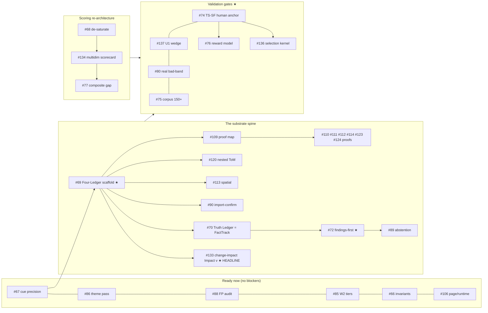

# StoryMachine — Task Index & Build Spine (reconciled 2026-07-12)

The single table of record for the 137-task backlog. Every forward task traces to a
research source (now archived in `_integrated_2026-07-12/`) or a planning doc
(`docs/canonical/*`, `docs/research-audit/*`). Use the **Build Spine** to pick what
to build; use the **Clusters** to see everything by theme.

Legend: ✅ done · ▶ ready (no open blockers) · ⛔ blocked (waiting on a dependency) · ★ existential/high-leverage.

---

## 0. The one-paragraph orientation

The app already **comprehends** imported scripts and has **real scene-order detection**
(shipped this session, #63–65). The backlog turns that comprehension into a
**Four-Ledger narrative state (#69/#70)**, routes **proof-carrying findings (#72)** and
the **change-impact "what breaks if I change this" (#133)** feature off it, decomposes
the saturating health scalar into a **multidimensional scorecard (#134)**, and validates
the whole thing against **humans (TS-SF #74, wedge U1 #137)**. Everything else is a
detector, a precision fix, or product surface hanging off that spine.

## 1. The Build Spine (critical path — build in this order)

**Recommended sequence:** the six **Ready-now** wins first (they improve the live doctor
this week) → run **#74 + #137 in parallel** (cheap, decide if any of it is valid) →
build the **Four-Ledger (#69/#70)** as the flagship → then findings (#72), change-impact
(#133), and the scorecard (#134) unlock everything downstream.

---

## 2. Clusters (all 137, by theme)

### A · Comprehension & the Four-Ledger substrate — *the spine*
| # | Task | State | Blocked by | Source |
|---|---|---|---|---|
| 69 | Four-Ledger NarrativeState scaffold ★ | ▶ | — | OASIS §15 |
| 70 | Truth Ledger = FactTrack over scenes | ⛔ | 69 | FactTrack paper |
| 120 | Nested ToM + epistemic genealogy | ⛔ | 69 | V4 |
| 113 | Spatial / knowledge-reachability proof | ⛔ | 69 | _CLEVER_MOVES/Pre-Flight |
| 90 | Import-confirmation loop + author locks | ⛔ | 69 | TRACE C.2 |
| 67 | Tighten isCharacterCue (roster precision) | ▶ | — | comprehension G5 |
| 87 | INTENTION_INVISIBLE cap + goal extraction | ▶ | — | COVERAGE_GAP §2 |
| 127 | Adopt reference wire schemas (world-ledger) | ▶ | — | Reference Engine 0.2.0 |
| 126 | Adopt check-definition metadata schema | ▶ | — | Reference Engine 0.2.0 |
| 108 | Detectors as stateless views over state | ▶ | — | _CLEVER_MOVES §0 |

### B · Findings-first product (Approach C) + proofs
| # | Task | State | Blocked by | Source |
|---|---|---|---|---|
| 72 | Findings-first report via surfacing+acquittal ★ | ⛔ | 69,70 | blueprint C |
| 133 | Change-impact Impact(v) — "what breaks" ★ HEADLINE | ⛔ | 69 | EXECUTION_PLAN E4 |
| 89 | Abstention + coverage certificate | ▶ | — | TRACE C.11 |
| 109 | 23-proof deterministic-predicate map | ⛔ | 69 | _CLEVER_MOVES §1 |
| 110 | EmotionProof (emotion caused not declared) | ⛔ | 69 | _CLEVER_MOVES |
| 111 | Scene-necessity certificate | ⛔ | 69 | _CLEVER_MOVES |
| 112 | Specificity / anti-generic centroid | ▶ | — | _CLEVER_MOVES |
| 114 | Bias / representation audit (Bechdel) | ▶ | — | _CLEVER_MOVES |
| 123 | CulturalCausalityProof | ▶ | — | v7 §8.3 |
| 124 | ImplicatureProof (subtext techniques) | ▶ | — | v7 §8.4 |
| 105 | Contradiction-families typology | ⛔ | 70 | ROADMAP B-wave |
| 106 | Page / runtime estimate | ▶ | — | REVIEW/ULTRAPLAN |
| 107 | Short-input "excerpt" caveat | ⛔ | 89 | REVIEW |

### C · Health scoring re-architecture
| # | Task | State | Blocked by | Source |
|---|---|---|---|---|
| 68 | De-saturate the density normalizer | ▶ | — | SATURATION_ROOT_CAUSE |
| 134 | Multidimensional scorecard | ▶ | — | EXECUTION_PLAN Phase D |
| 77 | Composite min-gap (excellence lever) | ⛔ | 68 | COMPOSITE_MINGAP |
| 135 | X(s) consistency clamp to [0,1] | ▶ | — | EXECUTION_PLAN E3 |
| 85 | W2 tier-weight corpus sweep | ▶ | — | COVERAGE_GAP §3 |
| 66 | Reframe invariants as declared ground truth | ▶ | — | blueprint red-team |

### D · Structural / arc detection
| # | Task | State | Blocked by | Source |
|---|---|---|---|---|
| 78 | Deep-read (LLM-per-scene) position-aware signals | ▶ | — | ULTRAPLAN §1.1 |
| 79 | Second/third structural axes | ⛔ | 78 | ULTRAPLAN §1.3 |
| 118 | Ending-space detector | ▶ | — | Pixar Axiom 8 |
| 119 | Non-classical structure-mode awareness | ▶ | — | _COMPLETING/v7 §20 |
| 131 | Arc-subversion / emergent-arc awareness | ▶ | — | MaxHermes SELF_IMPROVEMENT |
| 73 | Metamorphic suite expansion | ⛔ | 69 | OASIS §48 |

### E · Craft-detector family
| # | Task | State | Blocked by | Source |
|---|---|---|---|---|
| 71 | value-shift / boring-but-correct / cool-but-wrong | ▶ | — | OASIS §30 |
| 91 | Anti-sentimentality | ▶ | — | ROADMAP Tier-1 |
| 92 | Effort-supremacy flag | ▶ | — | Pixar Axiom 1 |
| 93 | Oxytocin window (post-climax breath) | ▶ | — | Pixar Axiom 9 |
| 94 | Scene-transition taxonomy | ▶ | — | ROADMAP Tier-1 |
| 95 | ArcDebt typed object | ▶ | — | ROADMAP Tier-2 |
| 96 | Pacing triple (velocity/accel/rhythm) | ▶ | — | ROADMAP Tier-2 |
| 97 | Dramatic-irony tracker | ⛔ | 69 | ROADMAP Tier-2 |
| 98 | Scene-state pacing model | ▶ | — | ROADMAP Tier-2 |
| 99 | Narrative stance vector (+ stance-drift) | ▶ | — | ROADMAP Tier-2 / v7 §21 |
| 100 | Signed relationship-graph harmony | ▶ | — | ROADMAP Tier-2 |
| 101 | Scene economy score | ▶ | — | ROADMAP R-wave |
| 102 | Confusion-vs-mystery metric | ▶ | — | ROADMAP R-wave |
| 103 | Speech-act signal channel | ▶ | — | R-wave / OASIS §31 |
| 104 | Narrator-reliability score | ⛔ | 69 | R-wave / OASIS §33 |
| 116 | Story-spine constraint | ▶ | — | Pixar Axiom 3 |
| 117 | Flaw-growth architecture | ▶ | — | Pixar Axiom 4 |
| 121 | Tension-vector-gap + escape-prob suspense | ⛔ | 69 | V4 |
| 125 | Commercial / production-constraint signals | ▶ | — | GODMODE §26 |
| 128 | Vertical / short-form (micro-drama) format | ▶ | — | Reference Engine |
| 130 | VAD compound-emotion fix (shipped signal) | ▶ | — | MaxHermes SELF_IMPROVEMENT |
| 132 | Deepen anti-slop beyond surface patterns | ▶ | — | MaxHermes SELF_IMPROVEMENT |

### F · Validation, data & the selection kernel — *the existential gates*
| # | Task | State | Blocked by | Source |
|---|---|---|---|---|
| 74 | TS-SF human anchor ★ EXISTENTIAL | ▶ | — | VERIFICATION_QUALITY |
| 137 | U1 5-screenwriter wedge validation ★ | ▶ | — | EXECUTION_PLAN Top-10 |
| 80 | Real bad-band (declared-bad + amateur) | ▶ | — | ULTRAPLAN §1.4 |
| 75 | Corpus growth 150+ + blind held-out slice | ▶ | — | ULTRAPLAN §4 |
| 88 | Structural-detector FP audit (72-corpus) | ▶ | — | COVERAGE_GAP §4 |
| 86 | Theme-statement inference (activate theme pass) | ▶ | — | COVERAGE_GAP §1 |
| 129 | Adopt reference labeled calibration corpus | ▶ | — | Reference Engine |
| 76 | Specialized reward model (selector aid) | ⛔ | 74 | MAESTRO / blueprint B |
| 136 | Selection / ranking kernel (score a slate) | ⛔ | 74 | ROADMAP Phase 4 |

### G · Wiring, product surface & generation-side — *lower priority*
| # | Task | State | Blocked by | Source |
|---|---|---|---|---|
| 81 | OWNE full integration onto StoryOp/ledger | ▶ | — | ULTRAPLAN §2 |
| 82 | Content-word clue-channel rebuild | ▶ | — | ULTRAPLAN §3.2 |
| 83 | Deployment: E2E + frontend tests + auth | ▶ | — | ULTRAPLAN §4 |
| 84 | Product-surface + generative-side backlog (grouped) | ▶ | — | ULTRAPLAN §5 / ROADMAP §5.9 |

---

## 3. Shipped foundation (#1–65, condensed)

The engine, its 72-script corpus + ratchets (shuffle-drop AUC floor 0.622, 6/6
discrimination, produced-anchor ≥80), the emotional-arc + anti-slop + 15 detector
modules (OWNE O1–O5, STORY GOD SG1–SG5, Tier-1 excellence), the W1 confidence
contract, the arc-incoherence structural deduction (act-swap 0.48→0.62), the
screenplay-comprehension normalizer (imports 0→hundreds of dialogue lines), the
Lion King ingest (corpus→72), and verified deployment hardening. Full detail in the
session docs under `docs/scoring/*` and `docs/canonical/*`.

## 4. Traceability

Every forward task's Source column points to a doc now archived in
`STORYMACHINE V1 REPO/_integrated_2026-07-12/` or `MAIN_StoryMachine_Engine_Logic/_integrated_2026-07-12/`
(each folder has a MANIFEST mapping file→task), or to a living planning doc in
`docs/canonical/` / `docs/research-audit/`. Nothing in the research corpus is
un-mapped; the git-repo `docs/` and the GOOB creative-project files are intentionally
retained (living plan / not evaluator research).
